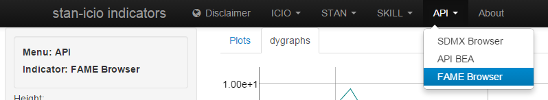

# FAME Browser

The application source code will soon be made available on
[GitHub](https://github.com/bowerth/desk/blob/master/inst/industry/tools/indic/fameBrowser.R)

This application provides a front-end to the __fame__ functions created by Jeffrey Hallman at the Federal Reserve Board. For additional information, see [fame on CRAN](http://cran.r-project.org/web/packages/fame/)

Functions used in the interface call C routines to retrieve time series from a FAME database and convert the output into R timeseries using the __tis__ and the __xts__ packages.
