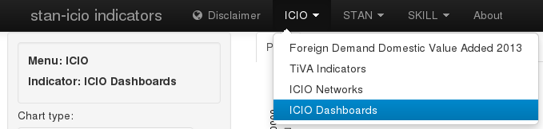
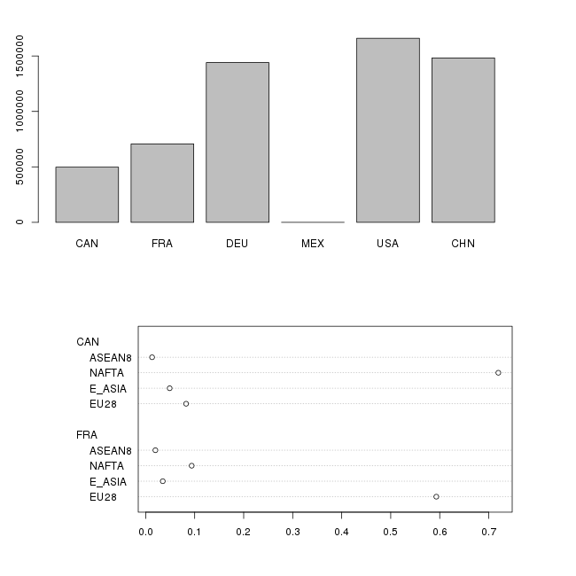
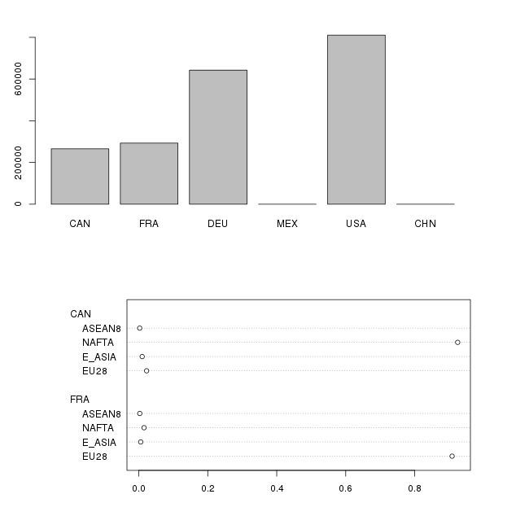

# ICIO Dashboards

The application source code is available on
[GitHub](https://github.com/bowerth/desk/blob/master/inst/industry/tools/indic/icioDash.R)

The current setup is demand country = `WOR` (total world, i.e. all columns)

Additional information is available from the help pop-up within the application

# Examples

## Gross trade share by partner region

Chart type
:   `GRTRnoDomestic`

Exporting Country List
:   `CAN FRA DEU MEX USA CHN`

Plot Exporting Country
:   `CAN FRA`

Year
:   `2008`

calculate share in total exports
:   `true`

## Value-added by source industry

Chart type
:   `VAsource`

(other parameters as above)

