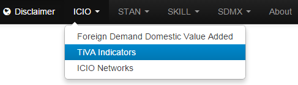

# ICIO TiVA Indicators

The application source code is available on
[GitHub](https://github.com/bowerth/desk/blob/master/inst/industry/tools/indic/icioIndic.R)

Indicators from the TiVA project
:   Application to generate charts from the 2013 TiVA country notes.

Interactive charts
:   The interactive charts below are using [d3.js](d3js.org).

## EXGRDVA_EX

<iframe src="/figures/app_icioIndic/exgrdvaex" marginwidth="0" marginheight="0" scrolling="no" width="800" height="400" frameborder="0"></iframe>

## SERVVAGR

<iframe src="/figures/app_icioIndic/servvagr" marginwidth="0" marginheight="0" scrolling="no" width="800" height="400" frameborder="0"></iframe>
