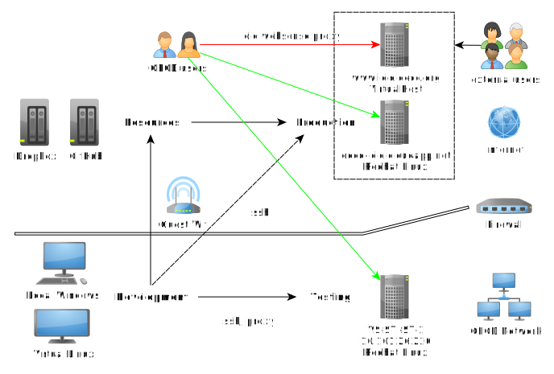

# icioapp2015


The application source code is available at
[GitHub](https://github.com/bowerth/icioapp2015)

## Application Architecture

<!-- from /home/xps13/Dropbox/GitHub/as_seminar_shiny/assets/img/architecture_users.graphml -->



### Accessibility

- Access to http://oecd-icio.cloudapp.net works always from the OECD network, however when attempting to open the application in full-screen mode from the homepage, the user is re-directed to www.icio.oecd.org:3838/icioapp2015. This can result in a error message, depending on the proxy that is used to establish the connection. A work-around from the OECD network is using the link http://oecd-icio.cloudapp.net:3838/icioapp2015.
- EXD/DKI/ISE is aware that access from the OECD network to www.icio.oecd.org is not stable due to blocked access by *old WebSense proxy*. Access from the public internet works without reported error. However, institutions like the World Bank have not white-listed the server domain.

### Intranet

The development and testing takes place within the organisation's intranet.

#### Development

The application is development on a Windows 7 machine. Contents of the testing environment can only be modified from within the OECD network. For ease of use, this is taking place from a virtual operation system (Fedora Linux) hosted by Oracle VirtualBox.

#### Testing (http://10.101.26.220:3838/icioapp2015)

The server is a virtual machine provided by courtesy of OECD EXD/DKI/ISE with a Redhat Linux server license (2 CPU, 4 GB RAM).

### Internet

#### Resources

Data and application source code are stored on public platforms before copied to the server. 

##### Dropbox

The application data is copied from Dropbox as described at https://github.com/bowerth/icioapp2015/wiki. In order to modify data using Dropbox, join shared folder *icioapp2015* of user *stan.contact@oecd.org*.

```
$ cd ~/Dropbox/GitHub/icioapp2015/data/external/
$ wget https://www.dropbox.com/s/4e1alsuj031krlk/DATA.ICIOeconCVB.Rdata
```

##### GitHub

The Shiny application source code is managed by `git` version control and stored at https://github.com/bowerth/icioapp2015. Two branches are used to manage features for the Test and Production environment, `develop` and `release`, respectively. The following commands can be executed from the network server VS-RDS-1 (e.g. using Remode Desktop \system32\mstsc.exe). Once logged in to the server, launch Putty from the command line and connect to server oecd-icio.cloudapp.net with the default configuration (SSH port 22).

```
# update remote repository after change in code base
$ cd ~/Dropbox/GitHub/icioapp2015/
$ git checkout release
$ git commit -a -m"commit message"
$ git push

```

```
# synchronise remote server with updated remote repository
$ cd ~/Dropbox/GitHub/icioapp2015/
$ git pull
$ git checkout release
$ cd ..
$ sudo rsync -h -v -P -t --recursive icioapp2015 /srv/shiny-server/
$ sudo chown -R shiny /srv/shiny-server/icioapp2015
```

#### Production (http://oecd-icio.cloudapp.net:3838/icioapp2015)

The production environement is hosted on a virtual server instance within the *Microsoft Azure OECD Cloud*. Access to this environment is open for the public user. Anyone with the appropriate server credentials can manage the server, independent of access to the OECD intranet.

##### VirtualHost

In order to allow access from the OECD domain www.icio.oecd.org, a VirtualHost has been specified in `/etc/httpd/conf/httdp.conf`

```
NameVirtualHost *:80

<VirtualHost *:80>
ServerName oecd-icio.cloudapp.net
ServerAlias oecd-icio.cloudapp.net *oecd-icio.cloudapp.net www.icio.oecd.org
DocumentRoot /var/www/html
</VirtualHost>
```

## Showcase

### Marimekko Chart

Hover over a tile to display country, industry and value. Position of tiles according to size.

green tiles
:   selected export or demand industries

blue tiles
:   indirect value-added

<iframe src="/figures/app_icioapp2015/visualize_dimple" marginwidth="0" marginheight="0" scrolling="no" width="800" height="500" frameborder="0"></iframe>

Source: http://timelyportfolio.github.io/docs/_build/html/dimple/gallery.html#example13-marimekko-vert-r

&copy; OECD (2015)
