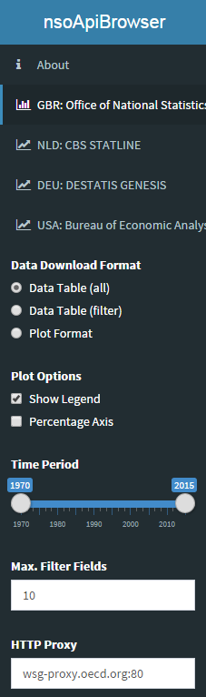

The application source code is available on [GitHub](https://github.com/bowerth/nsoApi)

## ONS Data Application Programming Interface

This application provides a front-end to the [ONS OpenAPI](https://www.ons.gov.uk/ons/apiservice/web/apiservice/home) of the UK Office for National Statistics

Chart using [dimple](http://dimplejs.org/) JS library implementation for R: [rcdimple](https://github.com/timelyportfolio/rcdimple)

dataset
:   `QS208EW`

context
:   `Census`

title
:   `Religion`

<iframe src="/figures/app_nsoApiBrowser/ONS_QS208EW" marginwidth="0" marginheight="0" scrolling="no" width="800" height="600" frameborder="0"></iframe>

To see x-axis, modify `height` parameter in page source: `<svg style="width: 100%; height: 100%;>`

## BEA Data Application Programming Interface

This application provides a front-end to the [API](http://www.bea.gov/API/) of the Bureau of Economic Analysis

dataset
:   `Fixed Assets`

table
:   `19`

<iframe src="/figures/app_nsoApiBrowser/BEA_FixedAssets" marginwidth="0" marginheight="0" scrolling="no" width="800" height="600" frameborder="0"></iframe>

## App Sidebar

