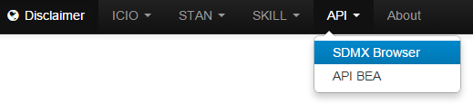

# SDMX Browser

The application source code is available on
[GitHub](https://github.com/bowerth/desk/blob/master/inst/industry/tools/indic/sdmxBrowser.R)

This application provides a front-end to the __RJSDMX__ functions created by Attilio Mattiocco and Diana Nicoletti at Bank of Italy.

These functions call a java library and convert the output into R timeseries using the __zoo__ package. The library can be reused in other statistical tools (e.g. MATLAB, Excel, SAS).

