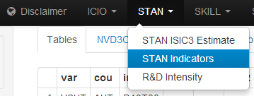

<!-- do not edit - this document has been created with stan/data-raw/create_vignette_stanIndicator.R -->

# STAN Indicators

The application source code is available on
[GitHub](https://github.com/bowerth/desk/blob/master/inst/industry/tools/indic/stanIndic.R)

Indicators derived from the STAN database
:   Calculations based on variables in STAN are popular for macroeconomic analysis, may it be simple indicators such as the share of an industry in the total ecomony or complex indicators such as the contribution of an industry to the economy's manufacturing trade balance.

Timeliness of results
:   To observe the ceteris paribus effects of data modifications on indicator results, it is helpful to use a self-standing calculation system. Underlying data of relatively small size are the only inputs into the system.

Maintenance and flexibility
:   The user interface and output elements of the application are designed in a functional form. Thereby, modifications can be implemented quickly, e.g. new indicators only require the calculation formula and users can be enabled modify the calculation formulas.

Data sources
:   Data underlying the calculations are STAN variables from National Accounts as well as ANBERD and BTDIxE. Please see documentation of STAN database for additional information.

## IITR

Intra-industry trade

Calculation
:   $$\rm{IITR}_i = \left( {1 - \frac{ \left| {expo_i - impo_i} \right| } {expo_i + impo_i}} \right) \times 100$$

Unit of measure used
:   PC

Other data characteristics
:   This index varies between 0 and 100. If a country exports and imports roughly equal quantities of a certain product, the index value is high. Whereas if trade is mainly one-way (whether exporting or importing), the index value is low.

Estimation
:   Intra-industry trade is the value of total trade remaining after subtraction of the absolute value of net exports or imports of an industry. 

    For comparison between countries and industries, the measures are expressed as a percentage of each industry's combined exports and imports. 

    For total manufacturing, the calculation is the summation of the value of total trade remaining after subtraction of the absolute value of net exports or imports for all manufacturing industries. 

    This indicator is not calculated for zones.

## CMTB

Contribution to manufacturing trade balance

Calculation
:   $$\rm{CMTB}_i = \frac{ \left( expo_i - impo_i \right) - \left( expo_{manuf} - impo_{manuf} \right) \frac{expo_i + impo_i}{expo_{manuf} + impo_{manuf}} }{ expo_{manuf} + impo_{manuf} } \times 100$$

Unit of measure used
:   PC

Other data characteristics
:   A positive value for an industry indicates a structural surplus and a negative one a structural deficit. The indicator is additive and individual industries can be grouped together by summing their respective values: by construction, the sum over all industries is zero. To allow comparisons across countries, the indicator is generally expressed as a percentage of total trade or of GDP. All formula and estimation methods are indicated in the document:http://www.oecd.org/dataoecd/52/54/47447210.pdf.

Estimation
:   The contribution to the trade balance enables to identify an economy's structural strengths and weaknesses via the composition of international trade flows. 

    It takes into account not only exports, but also imports, and tries to eliminate business cycle variations by comparing an industry's trade balance with the overall trade balance. It can be interpreted as an indicator of 'revealed comparative advantage', as it indicates whether an industry performs relatively better or worse than the manufacturing total, no matter whether the manufacturing total itself is in deficit or surplus. 

    If there were no comparative advantage or disadvantage for any industry, a country's total trade balance (surplus or deficit) should be distributed across industries according to their share in total trade. The 'contribution to the manufacturing trade balance' is the difference between the actual and this theoretical balance.

## EXIM

Export import ratio

Calculation
:   $$\rm{EXIM}_i = \frac{expo_i}{impo_i} \times 100$$

Unit of measure used
:   RATIO

Estimation
:   The export import ratio shows exports as a percentage of imports. 

    This indicator is also presented for a certain number of zones.

## TBAL

Trade balance - in US dollars

Calculation
:   $$\rm{TBAL}_i = expo_i - impo_i$$

Unit of measure used
:   USD

Power code
:   6

Estimation
:   Trade balance is the difference between the value of exports and imports of goods. Here, it is expressed in million of US dollars. 

    When exports' values exceed imports, there is a trade surplus. When imports'values exceed exports, there is a trade deficit.

## XSHT {#xsht}

Composition of total exports of goods

Calculation
:   $$\rm{XSHT}_i = \frac{expo_i}{expo_{total}} \times 100$$

Unit of measure used
:   PC

Other data characteristics
:   This indicator shows the exports of goods in a given industry as a percentage of total industries' exports of goods.

Estimation
:   The export market share shows the exports of a certain industry for a given country (or country group) as a percentage of the exports of this industry for the OECD zone. 

    The OECD here includes all OECD countries but Luxembourg (for which series are only available from 1999).

## XSHM

Composition of manufacturing exports of goods

Calculation
:   $$\rm{XSHM}_i = \frac{expo_i}{expo_{manuf}} \times 100$$

Unit of measure used
:   PC

Other data characteristics
:   Composition of manufacturing exports shows the exports in a given manufacturing industry as a percentage of total manufacturing exports.

Estimation
:   This indicator shows the share of nominal value added by industry in the total economy. It highlights the importance of each industry in the economies of OECD countries and is also presented for a certain number of zones (see zones specific to industrial structure).

## MSHT

Composition of total imports of goods

Calculation
:   $$\rm{MSHT}_i = \frac{impo_i}{impo_{total}} \times 100$$

Unit of measure used
:   PC

Other data characteristics
:   Composition of total imports shows the imports in a given industry as a percentage of total industries' imports.

Estimation
:   Import penetration indicator shows imports as a percentage of total domestic demand (this latter is estimated as production less exports plus imports). 

    Import penetration is presented for several zones. Intra-zone trade is excluded from calculations.

## MSHM

Composition of manufacturing imports of goods

Calculation
:   $$\rm{MSHM}_i = \frac{impo_i}{impo_{manuf}} \times 100$$

Unit of measure used
:   PC

Other data characteristics
:   Composition of manufacturing imports shows the imports in a given manufacturing industry as a percentage of total manufacturing imports.

Estimation
:   Import penetration indicator shows imports as a percentage of total domestic demand (this latter is estimated as production less exports plus imports). 

    Import penetration is presented for several zones. Intra-zone trade is excluded from calculations.

## XSHP

Export share of production

Calculation
:   $$\rm{XSHP}_i = \frac{expo_i}{prod_i} \times 100$$

Unit of measure used
:   RATIO

Other data characteristics
:   This indicator highlights the export effort and it is calculated as exports as a percentage of production. The export share of production shows the importance of the foreign market for a given industry in a country. This indicator may change over time as supply and demand conditions change in foreign and domestic markets. It is important to bear in mind that exports can exceed production. This can occur for the following reasons: 

    i. exports include re-exports (this particularly concerns countries such as Belgium and the Netherlands where there is a significant amount of 'transit trade'); 

    ii. production data are usually based on Industrial Surveys which record establishments' primary activities.  Therefore, activities that are mainly secondary may be understated in terms of production by not being allocated to the relevant ISIC code while exports of the related commodities are allocated to that ISIC code;

    iii. bias introduced by the conversion from product-based trade statistics to activity-based industry statistics for certain sectors for certain countries.

Estimation
:   The export market share shows the exports of a certain industry for a given country (or country group) as a percentage of the exports of this industry for the OECD zone. 

    The OECD here includes all OECD countries but Luxembourg (for which series are only available from 1999).

## MPEN

Import penetration

Calculation
:   $$\rm{MPEN}_i = \frac{impo_i}{prod_i - expo_i + impo_i} \times 100$$

Unit of measure used
:   RATIO

Other data characteristics
:   For a given country (or country group), a value close to 100 in a certain industry, implies that domestic demand is mainly fulfilled by imports and domestic production tends to be exported. A value close to 0 means self sufficient, i.e. domestic demand is mainly satisfied by domestic production. A value above 100 illustrates measurement problems which may occur when combining production and trade data. It is important to bear in mind that exports can exceed production. This can occur for the following reasons: 

    i. exports include re-exports (this particularly concerns countries such as Belgium and the Netherlands where there is a significant amount of 'transit trade'); 

    ii. production data are usually based on Industrial Surveys which record establishments' primary activities.  Therefore, activities that are mainly secondary may be understated in terms of production by not being allocated to the relevant ISIC code while exports of the related commodities are allocated to that ISIC code;iii. bias introduced by the conversion from product-based trade statistics to activity-based industry statistics for certain sectors for certain countries.

Estimation
:   Import penetration indicator shows imports as a percentage of total domestic demand (this latter is estimated as production less exports plus imports). 

    Import penetration is presented for several zones. Intra-zone trade is excluded from calculations.

## VSHT

Value added share relative to total economy

Calculation
:   $$\rm{VSHT}_i = \frac{valu_i}{value{total}} \times 100$$

Unit of measure used
:   PC

Other data characteristics
:   Note: The valuation of value added differs among countries and may therefore influence the interpretation of these indicators - value added is measured at basic prices for all countries except  Japan (at producer's prices) and the United States (at market prices).

Estimation
:   This indicator shows the share of nominal value added by industry in the total economy. It highlights the importance of each industry in the economies of OECD countries and is also presented for a certain number of zones (see zones specific to industrial structure).

## VSHM

Value added shares relative to manufacturing

Calculation
:   $$\rm{VSHM}_i = \frac{valu_i}{value_{manuf}} \times 100$$

Unit of measure used
:   PC

Other data characteristics
:   Note: The valuation of value added differs among countries and may therefore influence the interpretation of these indicators - value added is measured at basic prices for all countries except  Japan (at producer's prices) and the United States (at market prices).

Estimation
:   This indicator shows the share of nominal value added by industry in the total manufacturing. It highlights the contribution of each manufacturing industry to the total manufacturing sector.

## VAPR

Value added share of production

Calculation
:   $$\rm{VAPR}_i = \frac{valu_i}{prod_i} \times 100$$

Unit of measure used
:   RATIO

Estimation
:   Value added share of production relates to production structure.

## INPR

Intermediate consumption share of production

Calculation
:   $$\rm{INPR}_i = \frac{inti_i}{prod_i} \times 100$$

Unit of measure used
:   RATIO

Estimation
:   Intermediate consumption share of production related to production structure.

## RDST

Distribution of R&D expenditures across all activities

Calculation
:   $$\rm{RDST}_i = \frac{anberd_i}{anberd{total}} \times 100$$

Unit of measure used
:   PC

Estimation
:   This indicator shows the R&amp;D expenditures for an industry as a percentage of R&amp;D expenditures for the total economy. 

    R&amp;D expenditures data are expressed at current prices and are drawn from the STAN, R&amp;D Expenditure in Industry (ANBERD) which covers business R&amp;D and excludes government, public administration R&amp;D expenditures, etc. (see ANBERD metadata or Frascati Manual for further details). 

    In ANBERD, agriculture and primary production are included in the big total (cf industry CTOTAL).

## RDSM

Distribution of R&D expenditures across manufacturing activities

Calculation
:   $$\rm{RDSM}_i = \frac{anberd_i}{anberd{manuf}} \times 100$$

Unit of measure used
:   PC

Estimation
:   This indicator shows the R&amp;D expenditures for an industry as a percentage of R&amp;D expenditures for the total manufacturing. 

    R&amp;D expenditures data are expressed at current prices and are drawn from the STAN, R&amp;D Expenditure in Industry (ANBERD) which covers business R&amp;D and excludes government, public administration R&amp;D expenditures, etc. (see ANBERD metadata or Frascati Manual for further details). 

    In ANBERD, agriculture and primary production are included in the big total (cf industry CTOTAL).

## RDIV

R&D intensity using value added

Calculation
:   $$\rm{RDIV}_i = \frac{anberd_i}{valu_i} \times 100$$

Unit of measure used
:   RATIO

Estimation
:   R&amp;D intensities are calculated in two ways. The first expresses R&amp;D expenditures as a percentage of value added (indicator presented hereafter) while the second expressed R&amp;D expenditures as a percentage of production. 

    These two indicators cannot be calculated for most country groups and are not always available for recent years due to the difference in coverage between R&amp;D, production and value added data by country.

## RDIP

R&D intensity using production

Calculation
:   $$\rm{RDIP}_i = \frac{anberd_i}{prod_i} \times 100$$

Unit of measure used
:   RATIO

Estimation
:   R&amp;D intensities are calculated in two ways. The first expresses R&amp;D expenditures as a percentage of value added while the second expressed R&amp;D expenditures as a percentage of production (indicator presented here). 

    These two indicators cannot be calculated for most country groups and are not always available for recent years due to the difference in coverage between R&amp;D, production and value added data by country.

## ESHT

Employment shares in total economy

Calculation
:   $$\rm{ESHT}_i = \frac{empn_i}{empn_{total}} \times 100$$

Unit of measure used
:   PC

Estimation
:   This indicator addresses the issue of employment structure and shows for each industry the total employment (i. 

    e. total number of persons engaged) share in the total economy.

## ESHM

Employment shares in total manufacturing

Calculation
:   $$\rm{ESHM}_i = \frac{empn_i}{empn_{manuf}} \times 100$$

Unit of measure used
:   PC

Estimation
:   This indicator shows each industry's employment as a percentage of employment for total manufacturing.

## LBNT

Labour compensation per workforce in total economy

Calculation
:   $$\rm{LBNT}_i = \frac { \frac{labr_i}{empn_i} }{ \frac{labr_{total}}{empn_{total}} } \times 100$$

Unit of measure used
:   PC

Estimation
:   Labour compensation per employee relative to the total economy is calculated as the ratio of labour compensation for a particular industry (or industry group) to the number engaged divided by the ratio of labour compensation for the total economy to the number of persons engaged for the total economy.

## LBNM

Labour compensation per workforce in manufacturing

Calculation
:   $$\rm{LBNM}_i = \frac { \frac{labr_i}{empn_i} }{ \frac{labr_{manuf}}{empn_{manuf}} } \times 100$$

Unit of measure used
:   PC

Estimation
:   Labour compensation per employee relative to total manufacturing is calculated as the ratio of labour compensation for a particular manufacturing industry (or industry group) to the number engaged divided by the ratio of labour compensation for total manufacturing to the number of persons engaged for total manufacturing.

## LBET

Labour compensation per employee in total economy

Calculation
:   $$\rm{LBET}_i = \frac { \frac{labr_i}{empe_i} }{ \frac{labr_{total}}{empe_{total}} } \times 100$$

Unit of measure used
:   PC

Estimation
:   Labour compensation per employee relative to the total economy is calculated as the ratio of labour compensation for a particular industry (or industry group) to the number of employees divided by the ratio of labour compensation for the total economy to the number of employees for the total economy.

## LBEM

Labour compensation per employee in manufacturing

Calculation
:   $$\rm{LBEM}_i = \frac { \frac{labr_i}{empe_i} }{ \frac{labr_{manuf}}{empe_{manuf}} } \times 100$$

Unit of measure used
:   PC

Estimation
:   Labour compensation per employee relative to total manufacturing is calculated as the ratio of labour compensation for a particular manufacturing industry (or industry group) to the number of employees divided by the ratio of labour compensation for total manufacturing to the number of employees for total manufacturing.

## LBVA

Labour share of value added in total economy

Calculation
:   $$\rm{LBVA}_i = \frac{labr_i}{valu_i} \times 100$$

Unit of measure used
:   RATIO

Estimation
:   Labour shares of value added shows labour compensation in a certain industry as a percentage of value added in that industry. 

    Labour costs can exceed value added when an industry incurs losses or when an industry receives significant net subsidies (value added measured at producer's prices does not include subsidies). However, the occurrence of values exceeding 100 may also be due to measurement biases when certain series are estimates.

## IPYE

Labour productivity index

Calculation
:   $$\rm{IPYE}_i = \frac { \frac{valk_i}{empn_i} }{ \frac{valk_{i,2005}}{empn_{i,2005}} } \times 100$$

Unit of measure used
:   IDX

Reference period
:   2005_100

Estimation
:   Labour productivity is here calculated as the ratio of value added volumes to the number engaged. Labour productivity represents the amount of output per unit of input, output being here defined as value added while the input measure used is total employment. Series for this indicator are presented as indices, having data for the reference year of each country = 100 (most countries use 2005 as ref. year). This indicator is not calculated for zones (i.e. country groups).

## IPYH

Labour productivity index

Calculation
:   $$\rm{IPYH}_i = \frac { \frac{valk_i}{hrsn_i} }{ \frac{valk_{i,2005}}{hrsn_{i,2005}} } \times 100 $$

Unit of measure used
:   IDX

Reference period
:   2005_100

Estimation
:   Labour productivity is here calculated as the ratio of value added volumes to the number of hours worked. Labour productivity represents the amount of output per unit of input, output being here defined as value added while the input measure used is total hours worked. Series for this indicator are presented as indices, having data for the reference year of each country = 100 (most countries use 2005 as ref. year). This indicator is not calculated for zones (i.e. country groups).

## IULC

Unit labor cost index

Calculation
:   $$\rm{IULC}_i = \frac { \frac{empn_i}{empe_i} \times \frac{labr_i}{valk_i} }{ \frac{labr_{i,2005}}{valk_{i,2005}} } \times 100$$

Unit of measure used
:   IDX

Reference period
:   2005_100

Estimation
:   Unit labour cost is the the ratio of labour compensation at current prices to output as measured here by value added volumes. 

    It represents the current cost of labour to produce one unit of output and reflects how labour costs increase / decrease relative to output; it is an indicator of costs competitiveness. 

    Labour costs can exceed value added in certain cases; for example, when heavy losses are incurred within an industry or, more generally, when an industry's gross operating surplus is negative and/or it receives significant subsidies. 

    The series are presented as indices having the reference year of each country equal to 100 (most of countries use 2005 as ref. year). This indicator is not calculated for country groups / zones.

## LULC

Unit labor cost level

Calculation
:   $$\rm{LULC}_i = \frac{empn_i}{empe_i} \times \frac{labr_i}{valk_i}$$

Unit of measure used
:   RATIO

Estimation
:   Unit labour cost is the the ratio of labour compensation at current prices to output as measured here by value added volumes. 

    It represents the current cost of labour to produce one unit of output and reflects how labour costs increase / decrease relative to output; it is an indicator of costs competitiveness. 

    Labour costs can exceed value added in certain cases; for example, when heavy losses are incurred within an industry or, more generally, when an industry's gross operating surplus is negative and/or it receives significant subsidies. 

    The series are presented as levels. This indicator is not calculated for country groups / zones.

## AVHW

Average hours worked

Calculation
:   $$\rm{AVHW}_i = \frac{hrsn_i}{empn_i}$$

Unit of measure used
:   RATIO

Estimation
:   Average hours worked are the average number of hours worked per person per year.

## INVV

Investment intensity based on value added

Calculation
:   $$\rm{INVV}_i = \frac{gfcf_i}{valu_i} \times 100$$

Unit of measure used
:   RATIO

Estimation
:   This indicator is calculated as the ratio of gross fixed capital formation in a certain industry to value added in that industry.

## INVT

Investment shares relative to total economy

Calculation
:   $$\rm{INVT}_i = \frac{gfcf_i}{gfcf_{total}} \times 100$$

Unit of measure used
:   PC

Estimation
:   This indicator represents the investment composition of the total economy. It is calculated by dividing each industry's gross fixed capital formation by gross fixed capital formation for total economy.

## INVM

Investment shares relative to total manufacturing

Calculation
:   $$\rm{INVM}_i = \frac{gfcf_i}{gfcf_{manuf}} \times 100$$

Unit of measure used
:   PC

Estimation
:   Investment shares in total manufacturing represents the investment composition of manufacturing. It is calculated by dividing each manufacturing industry's gross fixed capital formation by gross fixed capital formation for total manufacturing.

