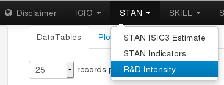
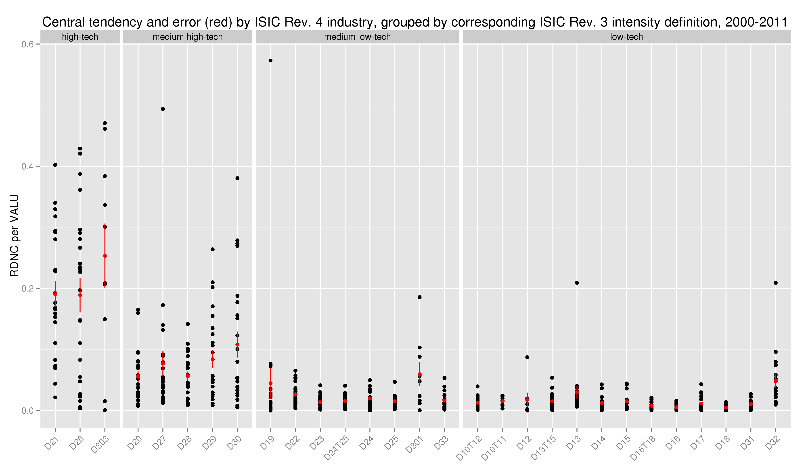

# R&D Intensity

The application source code is available on
[GitHub](https://github.com/bowerth/desk/blob/master/inst/industry/tools/indic/stanRnd.R)

Interpretation of R&D intensity
:   The ratio between expenditure for research and development (R&D) and value-added is an indicator for the research intensity of industries

Robustness of results
:   The R&D intensities are prone to outliers when both numbers are small. Aggregating values for both variables in a common currency (e.g. USD) is one option to come up with an average industry intensity

Data sources
:   Value-added and gross output data are used from STAN, R&D expenditures from ANBERD and exchange rates from the [OECD Annual National Accounts Main Aggregates PPPs and exchange rates](http://stats.oecd.org/Index.aspx?DataSetCode=SNA_TABLE4)

