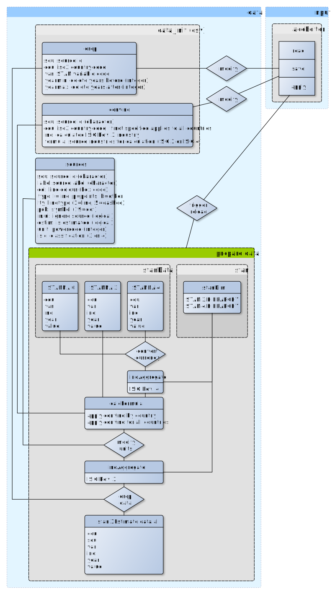
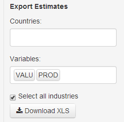
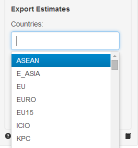
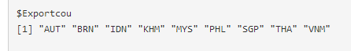

# STAN ISIC Rev.3 Estimation

The application source code is available on
[GitHub](https://github.com/bowerth/desk/blob/master/inst/industry/tools/indic/stani3Estimate.R)

<!-- copied from /stan/vignettes/stani3Estimate.Rmd -->
## General

STAN combines time series from National Accounts by economic
activity. The estimation methodology consists of three major
components:

 - extend or link main source with secondary sources using growth rates
 - increase detail by appling shares from secondary sources to aggregates of the main data source, e.g. combine data from National Accounts with Structural Business Statistics
 - top-down adjustment to ensure consistency on all levels of the industry hierarchy

## Interface Controls

### Tables

__Data__ Pivoted table of values for selected combination of country,
variable and industry dimensions by source with years in columns.

__Calculation__ If more than one variable or industry is selected, the
ratio between the two variables or industries is calculated by
default. Alternatively, the difference can be calculated.

### DataTables

__Sources__ Selected sources for estimation as stored in array
`stani3Estimate.rda`.

__Hierarchy__ Hierarchy of industry lists

### Plots

__Lines__ Line plot: multiple sources, one industry

__Bars__ Bar plot: one source, multiple industries

## Data

### Dimensions

__Country__ 3-digit ISO code

__Variable__ STAN variable code

__Industry__ STAN ISIC Rev. 3 industry code(s)

### Units

__Monetary variables__ million US Dollars

__EMP__ persons

### Sources

__EUNAMA__ Eurostat Annual National Accounts detailed breakdowns NACE Rev. 1.1 and NACE Rev. 2 (nama\_nace, nama\_nace2)

__EUNAIOR1__ Eurostat National Accounts IO tables in NACE Rev. 1 http://epp.eurostat.ec.europa.eu/portal/page/portal/esa95_supply_use_input_tables/introduction

__ICIO052013__ 1995, 2000, 2005, 2008 and 2009 values from OECD ICIO

__INDSTAT32__ UNIDO INDSTAT ISIC Rev. 3 2-digit business survey data http://stat.unido.org/home

__NSONAPATCH__ Data collected and harmonised from National Accounts published by National Statistical Offices not included in STAN

__OECDSUT__ Data from MATLAB procedure converted to ISIC Rev. 3 from respective national industry classification (conversions developed by external consultants)

__STANandBTD__ Variables from National Accounts by detailed industry
in ISIC Rev. 3 (latest year: 2009) (`IMPO` and `EXPO` from __Bilateral
Trade Database ISIC Rev. 3 (BTD)__)

__STANandBTDi4__ Variables from National Accounts by detailed industry
in ISIC Rev. 4, roughly converted to ISIC Rev. 3 (see ISIC 4 to ISIC 3 conversion table below, `IMPO` and `EXPO` from __Bilateral
Trade Database ISIC Rev. 4 (BTD)__)

__UNDATA203100-500__ UNSD Main Aggregates and Detailed Tables (MADT) http://data.un.org/Data.aspx?d=SNA&f=group_code%3a203

__UNDATA203CON__ combined MADT (linking backwards across revisions, starting with latest year)

__UNSDSNA2013__ UNSD Main Aggregates https://unstats.un.org/unsd/snaama

__WIOT__ World Input-Output Tables, released 04/2012 and 11/2013 http://www.wiod.org/new_site/database/wiots.htm

### Edits

__Min and max year__ Data points to be removed from sources (by country and variable) can be specified in the init file `stani3Estimate_drop.csv`

## Estimation

### Preview

The preview is limited in a way that it only allows to perform
estimations for one industry at a time. Therefore, the results in the
preview are not adjusted. Source information is read from and save in
the array `stani3Estimate_srcarray.rda`.

__Extend__ Extend main source with growth rates from secondary source

__Detail__ Apply distribution from secondary source to main source, preserving
existing detail in the main source

### Export

By default, the export function performs *Extend* and *Detail*
estimation for __all industries__ and adjusts the results. Depending on
the number of secondary sources for each combination of dimensions,
the procedure can take considerable time to finish (one minute per
country).

__Export countries__ Select the regions or countries to include in results

__Export variables__ Select variables to include in results

__Update results__ Check to run estimations and save updated results to
disk. Henceforth, latest results can be exported from object without
re-running the estimation procedure.

__Export flat file (csv)__ create long form table including results for all
available combinations selected for export

__Export Excel file(s)__ create Excel file for each selected country
with one sheet per variable

__Include calculations__ perform calculations with exported
variables. Currently defined are:

  - `VALUshPROD` = `VALU / PROD * 100`
  - `LABRshVALU` = `LABR / VALU * 100`
  - `VALUperEMPN` = `VALU / EMPN * 10^6`
  - `VALUshCTOTAL` = `VALU / VALU_CTOTAL * 100`

---

## Application Architecture

---

## Tutorial

Select country

Activate the two fields "Extend series" and "Applied detailed industry share"
the currently defined combination of sources will be inserted

click "Download XLS" to produce estimates

  - results for additional countries can be produced by selecting them
in the export section
  - this can take a while depending on the number of selected countries
  - when ready, a zip folder with all results will be downloaded

the vector of countries for exporting can be seen in the "Plots" tab
below the plot

## Example: Extend series

## Hierarchy for top-down adjustment

- CTOTAL  Total
    - C01T05  Agriculture, hunting, forestry and fishing
        - C01T02  Agriculture, hunting and forestry
            - C01  Agriculture, hunting and related service....
            - C02  Forestry, logging and related service ac....
        - C05  Fishing, fish hatcheries, fish farms and rel....
    - C10T41  Industry including energy
        - C10T14  Mining and quarrying
            - C10T12  Mining and quarrying of energy producing....
                - C10  Mining of coal and lignite, extracti....
                - C11  Extraction of crude petroleum and na....
                - C12  Mining of uranium and thorium ores
            - C13T14  Mining and quarrying except energy produ....
                - C13  Mining of metal ores
                - C14  Other mining and quarrying
        - C15T37  Manufacturing
            - C15T16  Food products, beverages and tobacco
                - C15  Food products and beverages
                - C16  Tobacco products
            - C17T19  Textiles, textile products, leather and ....
                - C17T18  Textiles and textile products
                    - C17  Textiles
                    - C18  Wearing apparel, dressing and dy....
                - C19  Leather, leather products and footwear
            - C20T22  Wood, paper, paper products, printing an....
                - C20  Wood and products of wood and cork
                - C21T22  Pulp, paper, paper products, printin....
                    - C21  Pulp, paper and paper products
                    - C22  Printing and publishing
            - C23T26  Chemicals and non-metallic mineral products
                - C23  Coke, refined petroleum products and....
                - C24  Chemicals and chemical products
                - C25  Rubber and plastics products
                - C26  Other non-metallic mineral products
            - C27T28  Basic metals and fabricated metal products
                - C27  Basic metals
                - C28  Fabricated metal products, except ma....
            - C29  Machinery and equipment, n.e.c.
            - C30T33  Electrical and optical equipment
                - C30T33X  Computer, electronic and optical equ....
                    - C30  Office, accounting and computing....
                - C31  Electrical machinery and apparatus, ....
                    - C32  Radio, television and communicat....
                    - C33  Medical, precision and optical i....
            - C34T35  Transport equipment
                - C34  Motor vehicles, trailers and semi-tr....
                - C35  Other transport equipment
            - C36T37  Manufacturing n.e.c. and recycling
                - C36  Manufacturing n.e.c.
                - C37  Recycling
        - C40T41  Electricity gas and, water supply
            - C40  Electricity, gas, steam and hot water supply
            - C41  Collection, purification and distributio....
    - C45  Construction
    - C50T64  Wholesale and retail trade - restaurants and hot....
        - C50T55  Wholesale and retail trade - restaurants and....
            - C50T52  Wholesale and retail trade - repairs
                - C50  Sale, maintenance and repair of moto....
                - C51  Wholesale, trade and commission excl....
                - C52  Retail trade excl. motor vehicles - ....
            - C55  Hotels and restaurants
        - C60T64  Transport, storage and communications
            - C60T63  Transport and storage
                - C60  Land transport - transport via pipelines
                - C61  Water transport
                - C62  Air transport
                - C63  Supporting and auxiliary transport a....
            - C64  Post and telecommunications
    - C65T99  Finance, insurance, real estate and business ser....
        - C65T74  Finance, insurance, real estate and business....
            - C65T67  Financial intermediation
                - C65  Financial intermediation, except ins....
                - C66  Insurance and pension funding, excep....
                - C67  Activities auxiliary to financial in....
            - C70T74  Real estate, renting and business activities
                - C70  Real estate activities
                - C71T74  Renting of mach. and equip. - other ....
                    - C71  Renting of machinery and equipment
                    - C72  Computer and related activities
                    - C73T74  Research and development and oth....
                        - C73  Research and development
                        - C74  Other business activities
        - C75T99  Community, social and personal services
            - C75  Public admin. and defence - compulsory s....
            - C80T93  Education, Health and social work, other....
                - C80  Education
                - C85  Health and social work
                - C90T93  Other community, social and personal....
                    - C90  Sewage and refuse disposal, sani....
                    - C91  Activities of membership organiz....
                    - C92  Recreational, cultural and sport....
                    - C93  Other service activities
            - C95  Private households with employed persons
            - C99  Extra-territorial organizations and bodies

&copy; OECD (2014)
