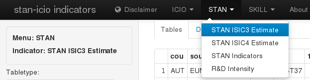
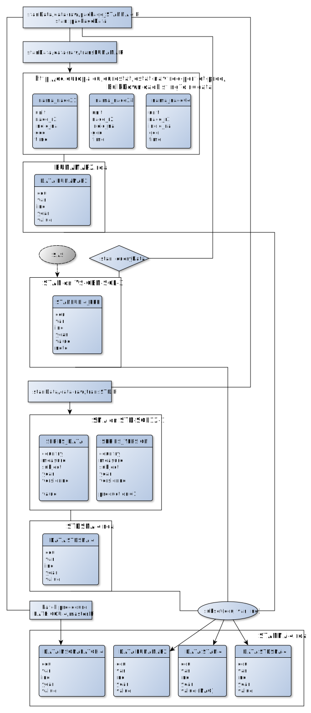

# STAN ISIC Rev.4 Estimation

<!--  -->
<!-- The application source code is available on -->
<!-- [GitHub](https://github.com/bowerth/desk/blob/master/inst/industry/tools/indic/stani3Estimate.R) -->

## Dimensions

time periods
:   `45`

variables
:   `30` published, `50` internal

country
:   `32` published, `62` internal (ICIO)

industry
:   `128` published, `188` internal

The number of possible combinations from these dimensions are:

total data series
:   `122880` published, `582800` internal

data points
:   `5529600` published, `26226000` internal

## Units

### Monetary variables

`VALU`, `PROD`, etc.
:   value-added, gross output etc.: million US Dollars

### Employment variables

`EMPN`, `EMPE`, `SELF`
:   number engaged, employees, self-employed: number of persons (headcounts)

`HRSN`, `HRSE`
:   hours worked: thousands of hours

## Data Workflow

### NSO sources

- ETL data from API (`stanData/data-raw/API`) or download files (`stanData/data-raw/FILE`)
- store as `[cou]_NSO.csv` at `stanData/inst/extdata` with dimensions `var`, `ind`, `year`, `value`
- install `stanData` package on server 10.101.26.220 using SSH connection (use configuration script `linux_server_config/shiny_server_update.R`)
- compare data using [10.101.26.220:3838/stan](http://10.101.26.220:3838/stan)
- create estimates using "STANi4 Estimate" widget at [10.101.26.220:3838/industry](http://10.101.26.220:3838/industry) (in order to export estimates to SQL, launch application instance from local Windows account with appropriate table write permissions - ODBC connection from Linux not yet implemented)
- access contents of SQL table using Excel workbook [stani4Estimate_SQL_example.xlsx](http://oecdshare.oecd.org/sti/eas/stan/STAN_SQL/stani4Estimate_SQL_example.xlsx) (required to be member of STAN users SharePoint group and member of Data Reader)
- export from SQL table to OECD.Stat using `createDotstatXML.exe` from R script `stanData/data-raw/DOTSTAT/exportSTANi4_SNA08.R` (the documentation of createDotstatXML.exe is available at `stan/vignettes/createDotStatXML.Rmd`)

### Harmonised Sources

&copy; OECD (2014)
