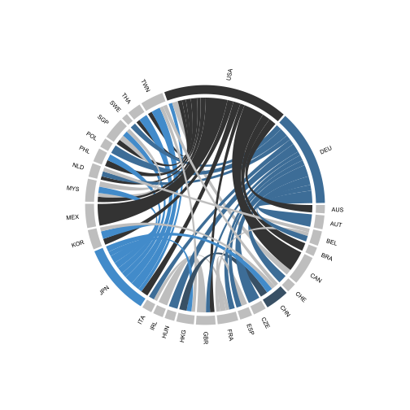
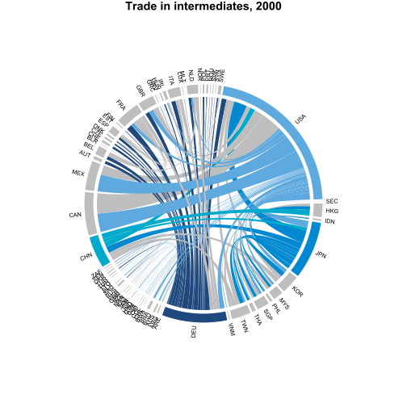
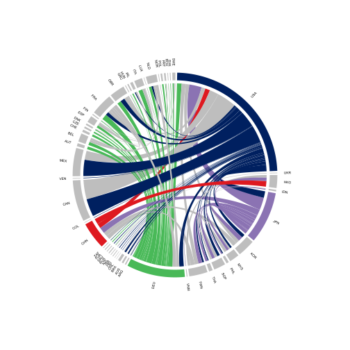
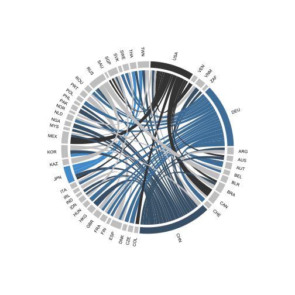
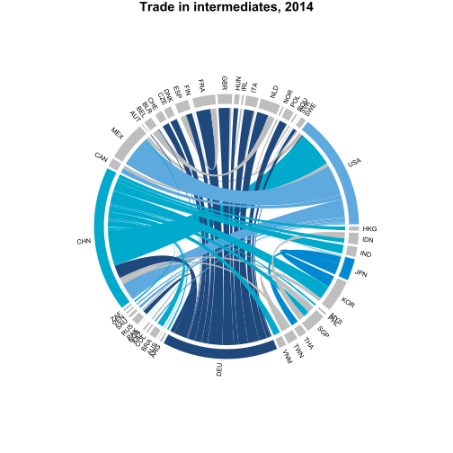
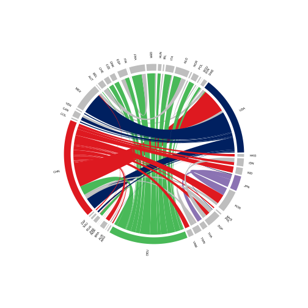

---

title: BTDIxE Score 15
layout: default_networkD3
output: bookdown::html_chapter
---

# Scoreboard 2015 - BTDIxE Section

## Interactive Chord diagram



## Trade in manufacturing intermediates, methodology {#int_method}

Data
:   Manufacturing intermediates bilateral import flows (no exports to avoid the re-exports issue)

Assumption
:   imports declared by a country coming from a partner is a proxy for exports declared by the partner going to the country

Notes
:   In case of missing info for 2014, year corresponds to 2013

Interpretation
:   `IMPO, reported by USA coming from partner CHN`

Calculation
:   For each reporter, calculate the import shares of each partner in the world's imports
    `100*( IMPO, reported by USA coming from partner CHN / IMPO, reported by USA coming from partner WORLD)`

Filter
:   - to reduce the number of arrows, only kept bilateral shares higher than `12%`
    - only kept import values which were higher than 5 USD billion

Invert values
:   An arrow going from CHN to USA it actually corresponds to the import share of INT goods declared by the USA coming from CHN (which is assumed to be equivalent to Chinese exports of INT goods to the USA).

## Trade in manufacturing intermediates, 2000 {#int_2000}
<!--  -->
<!--  -->

### Data shown in chart

<!-- |Exporting Country |Importing Country | Share in countries' total imports, percent| -->
<!-- |:-----------------|:-----------------|------------------------------------------:| -->
<!-- |USA               |MEX               |                                       76.7| -->
<!-- |USA               |CAN               |                                       72.4| -->
<!-- |DEU               |AUT               |                                       44.1| -->
<!-- |DEU               |CZE               |                                       41.2| -->
<!-- |GBR               |IRL               |                                       32.2| -->
<!-- |JPN               |TWN               |                                       31.7| -->
<!-- |DEU               |HUN               |                                       31.5| -->
<!-- |DEU               |CHE               |                                       30.9| -->
<!-- |DEU               |POL               |                                       30.1| -->
<!-- |JPN               |THA               |                                       29.8| -->
<!-- |USA               |BRA               |                                       28.5| -->
<!-- |JPN               |KOR               |                                       27.4| -->
<!-- |CHN               |HKG               |                                       26.3| -->
<!-- |USA               |AUS               |                                       26.2| -->
<!-- |USA               |JPN               |                                       25.1| -->
<!-- |JPN               |MYS               |                                       22.1| -->
<!-- |JPN               |PHL               |                                       22.0| -->
<!-- |USA               |PHL               |                                       21.9| -->
<!-- |USA               |KOR               |                                       21.6| -->
<!-- |JPN               |CHN               |                                       20.9| -->
<!-- |FRA               |ESP               |                                       20.7| -->
<!-- |CAN               |USA               |                                       20.6| -->
<!-- |DEU               |SWE               |                                       20.2| -->
<!-- |DEU               |BEL               |                                       20.1| -->
<!-- |DEU               |ITA               |                                       19.7| -->
<!-- |DEU               |FRA               |                                       19.6| -->
<!-- |JPN               |SGP               |                                       19.3| -->
<!-- |MYS               |SGP               |                                       18.8| -->
<!-- |DEU               |ESP               |                                       18.6| -->
<!-- |USA               |MYS               |                                       18.5| -->
<!-- |DEU               |NLD               |                                       17.8| -->
<!-- |USA               |SGP               |                                       17.7| -->
<!-- |JPN               |HKG               |                                       16.7| -->
<!-- |USA               |GBR               |                                       15.7| -->
<!-- |USA               |TWN               |                                       14.9| -->
<!-- |DEU               |GBR               |                                       14.2| -->
<!-- |TWN               |CHN               |                                       14.2| -->
<!-- |KOR               |CHN               |                                       14.0| -->
<!-- |NLD               |BEL               |                                       13.7| -->
<!-- |USA               |THA               |                                       13.6| -->
<!-- |SGP               |MYS               |                                       13.4| -->
<!-- |JPN               |USA               |                                       13.1| -->
<!-- |FRA               |BEL               |                                       13.1| -->
<!-- |TWN               |HKG               |                                       12.8| -->
<!-- |USA               |NLD               |                                       12.4| -->
<!-- |FRA               |ITA               |                                       12.3| -->

## Trade in manufacturing intermediates, 2014 {#int_2014}
<!--  -->
<!--  -->

### Data shown in chart

<!-- |Exporting Country |Importing Country | Share in countries' total imports, percent| -->
<!-- |:-----------------|:-----------------|------------------------------------------:| -->
<!-- |USA               |CAN               |                                       57.5| -->
<!-- |USA               |MEX               |                                       50.6| -->
<!-- |DEU               |AUT               |                                       41.5| -->
<!-- |RUS               |BLR               |                                       41.3| -->
<!-- |CHN               |HKG               |                                       40.8| -->
<!-- |RUS               |KAZ               |                                       37.8| -->
<!-- |ESP               |PRT               |                                       34.6| -->
<!-- |DEU               |CHE               |                                       32.1| -->
<!-- |DEU               |CZE               |                                       31.6| -->
<!-- |DEU               |HUN               |                                       31.6| -->
<!-- |CHN               |PAK               |                                       30.8| -->
<!-- |CHN               |NGA               |                                       30.1| -->
<!-- |CHN               |VNM               |                                       29.6| -->
<!-- |USA               |VEN               |                                       28.0| -->
<!-- |DEU               |POL               |                                       27.4| -->
<!-- |DEU               |DNK               |                                       27.2| -->
<!-- |CHN               |JPN               |                                       26.7| -->
<!-- |USA               |COL               |                                       25.8| -->
<!-- |CHN               |KOR               |                                       25.3| -->
<!-- |BRA               |ARG               |                                       24.6| -->
<!-- |JPN               |TWN               |                                       24.0| -->
<!-- |GBR               |IRL               |                                       23.8| -->
<!-- |DEU               |NLD               |                                       23.0| -->
<!-- |JPN               |THA               |                                       22.4| -->
<!-- |DEU               |ROU               |                                       21.7| -->
<!-- |DEU               |SWE               |                                       21.6| -->
<!-- |CHN               |TWN               |                                       21.2| -->
<!-- |DEU               |SVK               |                                       21.2| -->
<!-- |CHN               |AUS               |                                       20.9| -->
<!-- |JPN               |KOR               |                                       20.9| -->
<!-- |DEU               |FRA               |                                       20.5| -->
<!-- |CHN               |BRA               |                                       20.1| -->
<!-- |KOR               |VNM               |                                       20.0| -->
<!-- |CHN               |IND               |                                       19.4| -->
<!-- |DEU               |FIN               |                                       19.3| -->
<!-- |CHN               |ARG               |                                       19.3| -->
<!-- |SGP               |IDN               |                                       19.1| -->
<!-- |CHN               |ZAF               |                                       18.8| -->
<!-- |CHN               |PHL               |                                       18.6| -->
<!-- |DEU               |ITA               |                                       18.5| -->
<!-- |CHN               |MYS               |                                       18.1| -->
<!-- |CHN               |THA               |                                       18.0| -->
<!-- |DEU               |GBR               |                                       17.9| -->
<!-- |DEU               |ESP               |                                       17.3| -->
<!-- |CHN               |USA               |                                       16.9| -->
<!-- |FRA               |ESP               |                                       16.6| -->
<!-- |USA               |BRA               |                                       16.5| -->
<!-- |DEU               |BEL               |                                       16.0| -->
<!-- |KOR               |CHN               |                                       15.3| -->
<!-- |SWE               |NOR               |                                       15.2| -->
<!-- |CHN               |MEX               |                                       15.0| -->
<!-- |CAN               |USA               |                                       14.5| -->
<!-- |CHN               |RUS               |                                       14.4| -->
<!-- |USA               |SGP               |                                       14.2| -->
<!-- |NLD               |BEL               |                                       14.1| -->
<!-- |TWN               |CHN               |                                       14.0| -->
<!-- |TWN               |SGP               |                                       13.8| -->
<!-- |CHN               |IDN               |                                       13.7| -->
<!-- |USA               |AUS               |                                       13.6| -->
<!-- |DEU               |RUS               |                                       13.5| -->
<!-- |USA               |SAU               |                                       13.4| -->
<!-- |ITA               |ROU               |                                       13.3| -->
<!-- |USA               |JPN               |                                       13.3| -->
<!-- |CHN               |SGP               |                                       13.0| -->
<!-- |MEX               |USA               |                                       13.0| -->
