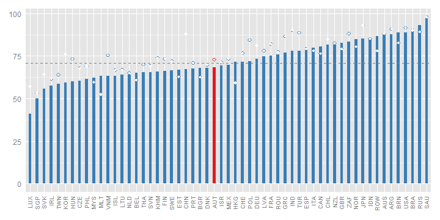
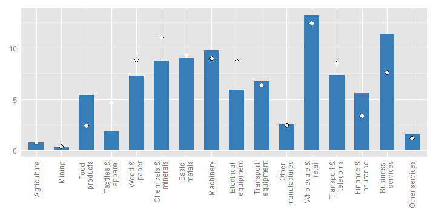
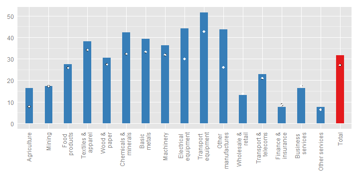
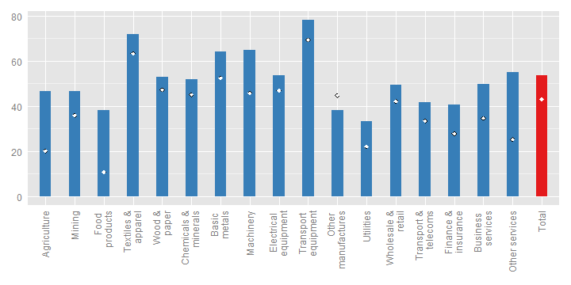
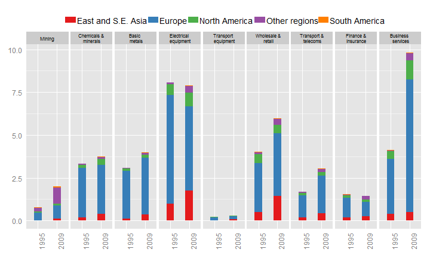
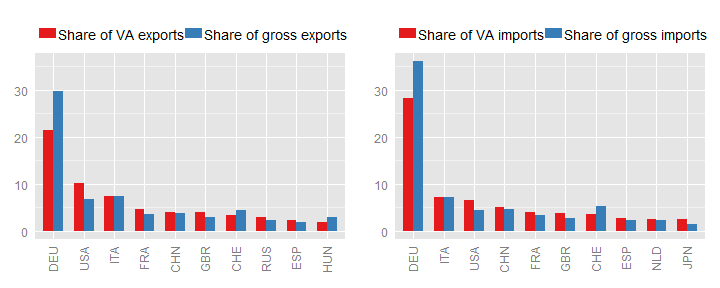
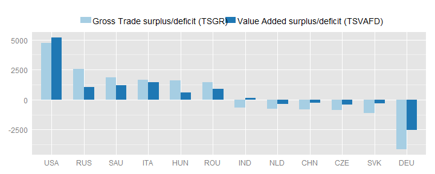
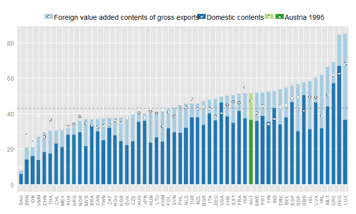
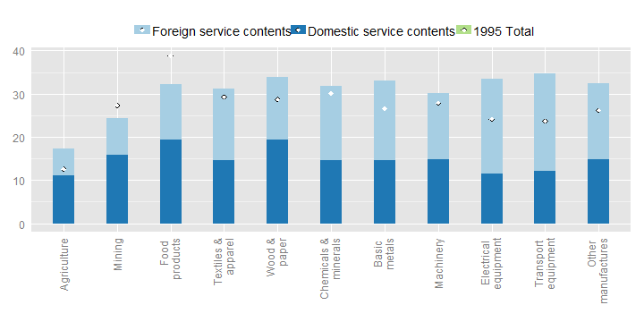

	   
# Trade in Value-added: Austria

## EXGRDVA\_EX {#exgrdvaex}

### Domestic value added content of gross exports, 2009, %
 

Austria's domestic value-added content of its exports is, at 68%, around the OECD average in 2009.

Austria’s domestic value added content of its exports was 68% in 2009 lower than the OECD average and 4 percentage points (pp) lower than the share in 1995 (Fig. 1). Like many other countries, the domestic value added content of Austria’s exports rose slightly in 2009, compared to 2008, indicating that global value chains were more affected by the synchronised collapse in international trade at the height of the crisis than more domestic value chains.

## EXGRDVA {#exgrdva}

### Domestic Value added in gross exports, industry shares, 2009, %
 

## EXGR\_FVASH {#exgrfvash}

### Foreign value-added content of gross exports, by industry, 2009, %
 

The foreign content of its exports is highest in the transport equipment industry, where about 52% of the value of exports consists of foreign value added.
The electrical equipment, other manufactures and chemicals and minerals industries also have relatively high shares of foreign content (42-44%).

Looking at individual industries (Fig. 2) reveals that the foreign value added content of Austria's exports in 2009 was highest in the following industries: Transport equipment (52%), Electrical equipment and Other manufactures (44%), and Chemicals and minerals (42%). With some exceptions, notably the Food products industry where the foreign content share fell by 11 pp between 2009 and 1995, the foreign value added content of Austrian exports rose in most good industries while remaining broadly stable for services.

## REI {#rei}

### Share of imported intermediate inputs that are exported, by import category, 2009, %
 
  
The share of intermediate imports that are used in producing exports are highest in the following industries:
transport equipment (78%);
textile and apparel (72%);
machinery (65%);
basic metals (64%);
other services (55%) and
electrical equipment (54%),
illustrating the integration of many Austrian industries in global value chains.
54% of all intermediate imports are used to produce exports.

Interesting patterns emerge when looking at the share of intermediate imports used to produce exports (Fig. 3). In particular, the share of intermediate imports of Agriculture, Food products, Machinery and Other services rose substantially between 1995 and 2009, and in some cases more than doubled. At the industry level, the highest shares of imported intermediates, subsequently exported, in 2009 were observed in the Transport equipment and Textiles and apparels industries, with 78% and 72% respectively. At the total economy level, more than half of all intermediate imports were used to generate exports in 2009.

## EXGR\_VA\_BSCI {#exgrvabsci}
### Origin of foreign value-added in gross exports, electrical equipment (ISIC Rev. 3 30T33), by region and product group, 2009, %
 

In 2009,
10% of
Austria's exports in value added terms originated in the
business services sector. The industry is well integrated in global value chains, with significant inputs of intermediate goods and services from Europe (26% of the value added in gross exports)

About 40% of the total value of Austrian output of transport equipment originated in other European countries, 7 pp higher than in 1995. The shares provided by East and S.E. Asia also increased, by nearly 2 pp, while the contribution of North American transport equipment manufacturers declined by 2 pp between 1995 and 2009. Much of the driver for the overall increase in the foreign content of Austrian transport equipment was provided by the service sector, with the shares of Business services and Other services reaching 10% and 11% respectively, in 2009.

## FDDVASH {#fddvash}

### Exports and imports, partner shares, in gross and value-added terms, 2009, % of total
 

Looking at gross flows Germany and Italy are Austria's major trading partners, consuming about 30% and 7% of its exports, respectively.
In value-added terms, Germany remains Austria's biggest partner, consuming about 21% of its exports and United States becomes it's second biggest partner.

Germany was by far Austria’s principal trading partner in 2009 both in value added and gross terms (Fig. 5a). However, in value added terms, the United States was notably more important than neighbouring countries, such as Italy, as a market for Austrian exports, reflecting Austrian value added embodied in the exports of other European countries to the United States. On the import side, Italy and the U.S. remained Austria’s second most important sources of imports in 2009 (Fig. 5b).

## TSVAFD {#tsvafd}

### Bilateral trade balances, USD million, 2009
 

Notable differences in Austria's trade balance positions with respect to some major trading partners emerge when the domestic value added embodied in exports, and intermediate imports embodied in exports are taken into account (Fig. 6). In particular, Austria saw a larger trade surplus with the United States in value added terms in 2009, reflecting Austrian value added increasingly embodied in the exports of third countries to the United States. Equally, Austria’s trade deficit with Germany was smaller in value added terms in 2009, reflecting the relatively lower domestic value added content of German exports.

## SERV\_VAGR {#servvagr}

### Services content of gross exports, 2009
 
  
In value added terms about 52% of Austria's exports reflect services.
This is above the (unweighted) OECD average (about 43%).

Over half of Austria's exports reflect services in value added terms, marginally higher than both the OECD average (48%) and the share in 1995 (Fig. 7). The contribution of services rose in virtually all industries, between 1995 and 2009, with the notable exception of the Food products industry, which fell by 25 pp. More than half of the total value of exports in these sectors reflects services content, where foreign services made up one-third of the total value.

## SERV\_VAGR (ind) {#servvagrind}

### Services content of gross exports, by industry, 2009
 

The information included in this note is based on the May 2013 release of the Trade in Value-Added (TiVA) database. The data can be accessed from http://www.oecd.org/trade/valueadded. For further information, please contact tiva.contact@oecd.org.
