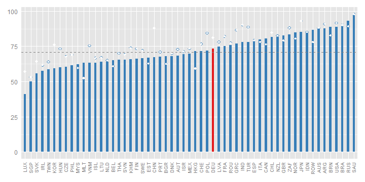
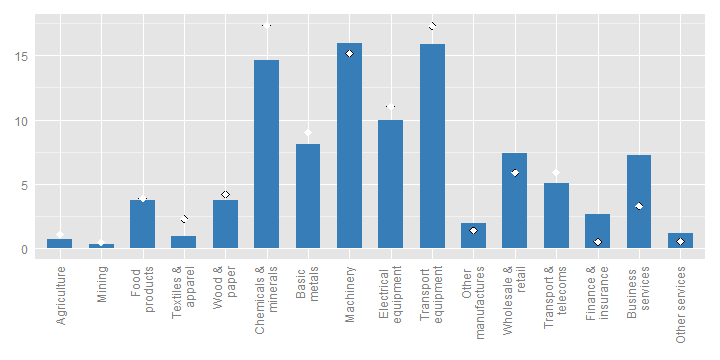
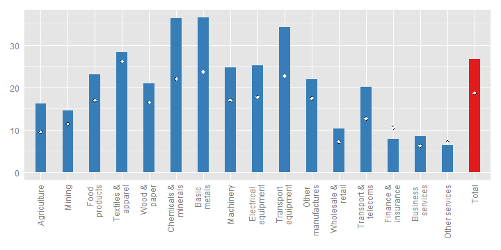
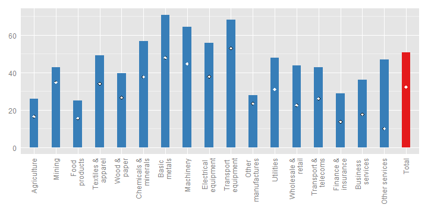
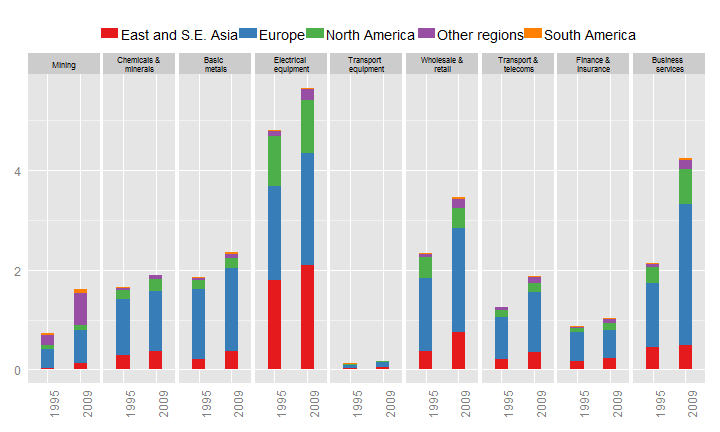
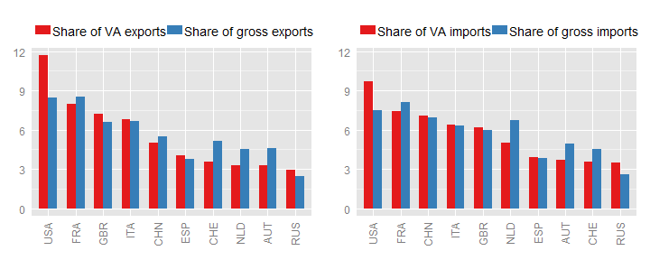
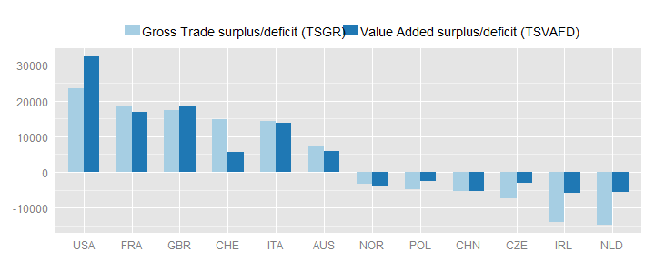
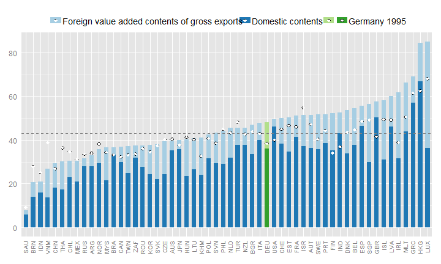
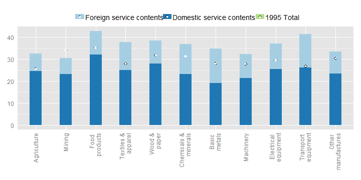

	   
# Trade in Value-added: Germany

## EXGRDVA\_EX {#exgrdvaex}

### Domestic value added content of gross exports, 2009, %
 

Germany's domestic value-added content of its exports is, at 73%, around the OECD average in 2009.

Germany's domestic value added content of its exports was 73% in 2009 slightly below the OECD average (76%) and 8 percentage points (pp) lower than the share in 1995, illustrating increasing fragmentation of production and integration into global value chains (Fig. 1). Like many other countries, the domestic value added content of Germany’s exports rose slightly in 2009, compared to 2008, indicating that global value chains were more affected by the synchronised collapse in international trade at the height of the crisis than more domestic value chains.

## EXGRDVA {#exgrdva}

### Domestic Value added in gross exports, industry shares, 2009, %
 

## EXGR\_FVASH {#exgrfvash}

### Foreign value-added content of gross exports, by industry, 2009, %
 

The foreign content of its exports is highest in the basic metals industry, where about 37% of the value of exports consists of foreign value added.
The chemicals and minerals, transport equipment and textile and apparel industries also have relatively high shares of foreign content (28-36%).

The foreign content of Germany's exports was around 35% in the Basic metals and Chemicals and minerals and Transport equipment industries in 2009, about the same as the OECD (un-weighted) average, and in each case over 10 pp higher than the percentages in 1995 (Fig. 2).

## REI {#rei}

### Share of imported intermediate inputs that are exported, by import category, 2009, %
 
  
The share of intermediate imports that are used in producing exports are highest in the following industries:
basic metals (71%);
transport equipment (68%);
machinery (65%);
chemicals and minerals (57%);
electrical equipment (56%) and
textile and apparel (49%),
illustrating the integration of many German industries in global value chains.
51% of all intermediate imports are used to produce exports.

Over two thirds of total intermediate imports of Basic metals and Transport equipment products and over half of Chemical and minerals and Electrical equipment products were used to produce exports in 2009 (Fig. 3). Percentages rose in all products relative to 1995, rising by around 20 pp in the four previously mentioned product groups, reflecting Germany's increasing integration into the global value chains of these respective industries. Percentages were also significant across services products reflecting the increasing integration of outsourced services in manufacturing value chains.

## EXGR\_VA\_BSCI {#exgrvabsci}
### Origin of foreign value-added in gross exports, electrical equipment (ISIC Rev. 3 30T33), by region and product group, 2009, %
 

In 2009,
6% of
Germany's exports in value added terms originated in the
electrical equipment sector. The industry is well integrated in global value chains, with significant inputs of intermediate goods and services from Europe (13% of the value added in gross exports)

Nearly one-quarter of the total value of Germany's exports of Transport equipment originated in other European countries, 8 pp higher than in 1995 (Fig. 4). Shares provided by East and S.E. Asian and North American industries also increased by 2 and 1 pp respectively, indicating the increasingly global nature of the European production hub. A significant driver for the overall increase in the foreign content of German transport equipment was provided by the service sector, with the share of Business services more than doubling to over 5%, with noticeable increases in the European and North American contributions.

## FDDVASH {#fddvash}

### Exports and imports, partner shares, in gross and value-added terms, 2009, % of total
 

Looking at gross flows France and United States are Germany's major trading partners, consuming about 9% and 8% of its exports, respectively.
In value-added terms, United States becomes Germany's biggest partner, consuming about 12% of its exports and France becomes it's second biggest partner.

In value added terms, the United States displaced France both as Germany's main export market and its main source of imports, reflecting the high degree of trade in intermediates between France and Germany, with exports from both countries containing significant value added created in the other, with many final exports heading to the United States (Fig. 5).

## TSVAFD {#tsvafd}

### Bilateral trade balances, USD million, 2009
 

These various flows, domestic value added embodied in exports and intermediate imports embodied in exports, combine to reveal notable differences in Germany’s trade balance positions with some of its major trading partners (as recorded in the OECD-WTO TiVA database). Germany's trade surplus with the United States for example increases significantly as German value added is increasingly embodied in the exports of third countries to the United States (Fig. 6). At the same time Germany's trade deficit with Ireland is smaller in value added terms, reflecting the relatively low domestic value added content of Irish exports and also with the Netherlands, driven in part by significant exports of Dutch value added embodied in German products.

## SERV\_VAGR {#servvagr}

### Services content of gross exports, 2009
 
  
In value added terms about 48% of Germany's exports reflect services.
This is above the (unweighted) OECD average (about 43%).

In value added terms nearly half of Germany's exports in 2009 reflected services, the same as the OECD average (48%) and 10 pp higher than the share in 1995 (Fig. 7). The contribution of services rose in nearly all industries, particularly the Transport equipment sector, where the services content increased from 27% in 1995 to 41% in 2009 (Fig. 8). Shares of around 40% were also seen in the Food, Textiles, Wood and paper, and Chemicals and minerals, industries.

## SERV\_VAGR (ind) {#servvagrind}

### Services content of gross exports, by industry, 2009
 

The information included in this note is based on the May 2013 release of the Trade in Value-Added (TiVA) database. The data can be accessed from http://www.oecd.org/trade/valueadded. For further information, please contact tiva.contact@oecd.org.
