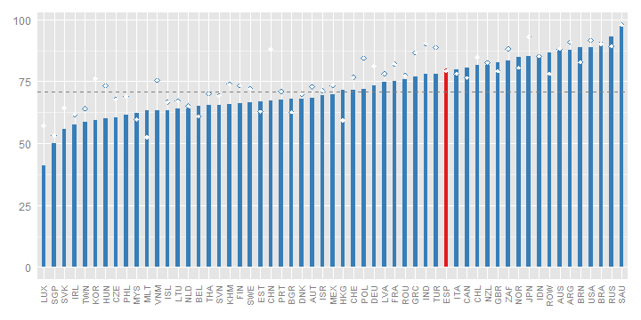
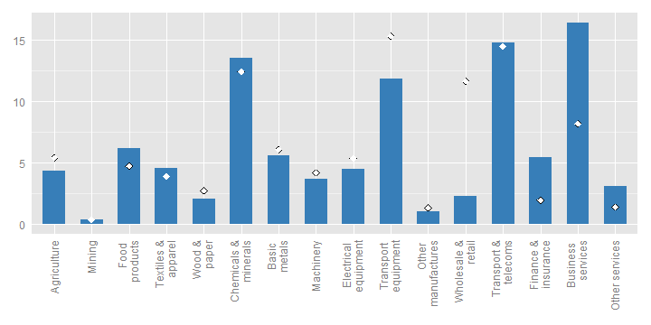
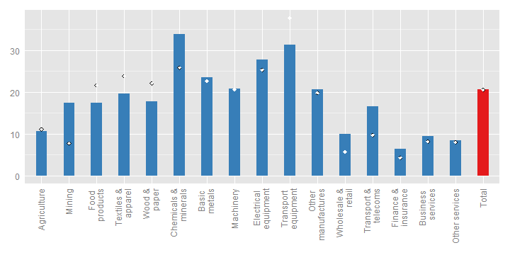
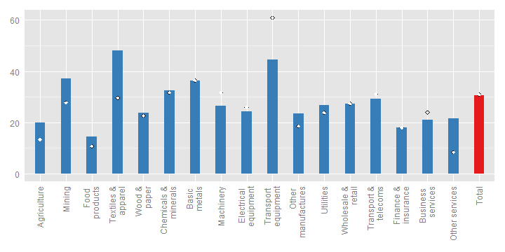
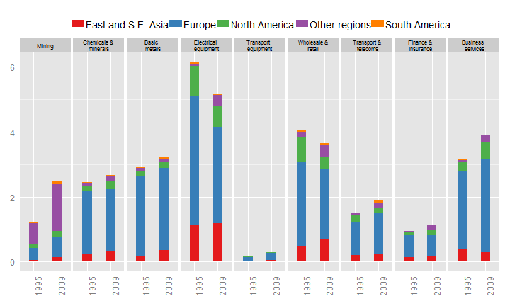
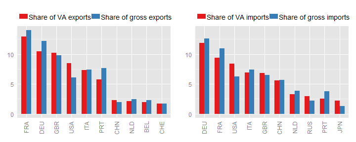
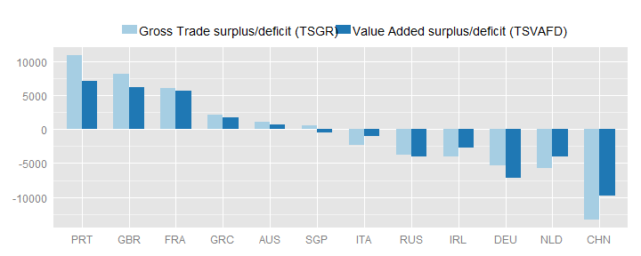
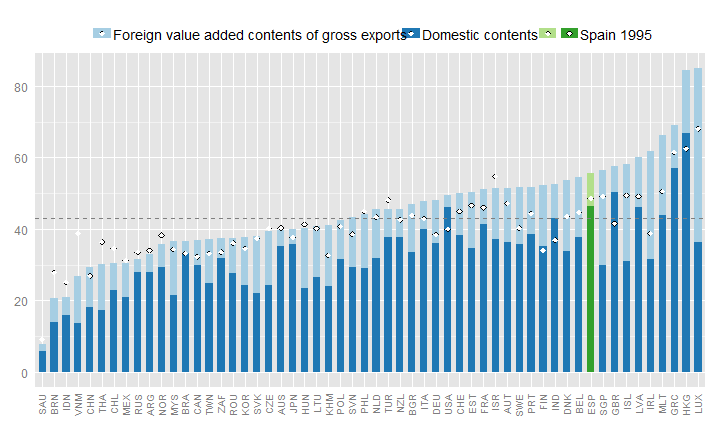
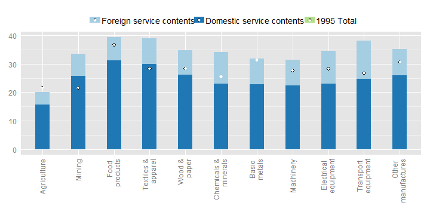

	   
# Trade in Value-added: Spain

## EXGRDVA\_EX {#exgrdvaex}

### Domestic value added content of gross exports, 2009, %
 

Spain's domestic value-added content of its exports is, at 79%, above the OECD average in 2009.

Spain’s domestic value-added content of its exports was 79% in 2009, above the OECD average and at the same level as in 1995 (Fig. 1). The foreign content in Spain’s exports rose between 1995 and 2005 from 21% to 28% before falling back to 21% in 2009, partly reflecting the effects of the financial crisis and its proportionally greater impact on globally fragmented production chains than domestic value chains.

## EXGRDVA {#exgrdva}

### Domestic Value added in gross exports, industry shares, 2009, %
 

## EXGR\_FVASH {#exgrfvash}

### Foreign value-added content of gross exports, by industry, 2009, %
 

The foreign content of its exports is highest in the chemicals and minerals industry, where about 34% of the value of exports consists of foreign value added.
The transport equipment, electrical equipment and basic metals industries also have relatively high shares of foreign content (24-31%).

The foreign content of exports was highest in the Chemicals and minerals (34%), Transport equipment (31%) and Electrical equipment (28%) industries. From 1995 to 2009, the share of embodied foreign content rose most in Chemicals and minerals, while it declined in Transport equipment, Food products and Textiles and apparel. As in other countries, domestic content is higher in services sectors than in goods sectors, although the foreign content share reached 17% in Transport and telecoms in 2009 (Fig. 2).

## REI {#rei}

### Share of imported intermediate inputs that are exported, by import category, 2009, %
 
  
The share of intermediate imports that are used in producing exports are highest in the following industries:
textile and apparel (48%);
transport equipment (45%);
mining (37%);
basic metals (36%);
chemicals and minerals (32%) and
transport and telecommunications (29%),
illustrating the integration of many Spainish industries in global value chains.
31% of all intermediate imports are used to produce exports.

The share of intermediate imports used in producing exports was highest in Textiles and apparel (48%) and Transport equipment (45%), reflecting Spain’s high integration in global value chains in these activities (Fig. 3). In total, 31% of all intermediates imported by Spain in 2009 were used to produce exports, a share similar to that in 1995.

## EXGR\_VA\_BSCI {#exgrvabsci}
### Origin of foreign value-added in gross exports, electrical equipment (ISIC Rev. 3 30T33), by region and product group, 2009, %
 

In 2009,
5% of
Spain's exports in value added terms originated in the
electrical equipment sector. The industry is well integrated in global value chains, with significant inputs of intermediate goods and services from Europe (15% of the value added in gross exports)

The origin of foreign value-added in Transport equipment illustrates Spain’s participation in regional value chains in this industry. In 2009, 22% of the total value of Spain’s exports of transport equipment originated in other European countries (Fig. 4). Apparently, however, the contribution of other European producers was lower than in 1995 (30%). The share of intermediate inputs sourced from all European manufacturing sectors decreased sharply, which drove the overall increase of domestic content in transport equipment. At the same time, the foreign content shares provided by East and South East Asia (3%) and North America (2.7%) remained stable.

## FDDVASH {#fddvash}

### Exports and imports, partner shares, in gross and value-added terms, 2009, % of total
 

Looking at gross flows France and Germany are Spain's major trading partners, consuming about 14% and 12% of its exports, respectively.
In value-added terms, France remains Spain's biggest partner, consuming about 13% of its exports and Germany remains it's second biggest partner.

France and Germany are Spain’s main trading partners when looking at both gross and value-added flows (Fig. 5). But in value-added terms Spain exports less to France (13%) and Germany (10%), indicating that it supplies inputs that eventually end up in third markets such as the United Kingdom and the United States, whose shares are higher in value-added terms than in gross terms. A similar pattern is found in imports. Among export destinations, Portugal goes from 4th to 6th position when looking at value-added flows.

## TSVAFD {#tsvafd}

### Bilateral trade balances, USD million, 2009
 

The domestic value-added embodied in exports and intermediate imports embodied in exports combine to reveal significant differences in Spain’s bilateral trade positions with Portugal, the United Kingdom, Germany and China (as recorded in the OECD-WTO TiVA database). In particular, the deficit in value-added terms is smaller with China but larger with Germany (Fig. 6).

## SERV\_VAGR {#servvagr}

### Services content of gross exports, 2009
 
  
In value added terms about 56% of Spain's exports reflect services.
This is above the (unweighted) OECD average (about 43%).

In value-added terms, at 56%, the services content of Spain’s gross exports was above the OECD average (48%), reflecting the country’s relative specialisation in services as well as the role of services as inputs to the manufacturing sector. This share increased between 1995 and 2009 (Fig. 7). The services content of Spain’s value-added is especially high in Food products and Textiles and apparel (Fig. 8), as well as in Transport equipment which has the highest contribution of foreign-sourced services (13%).

## SERV\_VAGR (ind) {#servvagrind}

### Services content of gross exports, by industry, 2009
 

The information included in this note is based on the May 2013 release of the Trade in Value-Added (TiVA) database. The data can be accessed from http://www.oecd.org/trade/valueadded. For further information, please contact tiva.contact@oecd.org.
