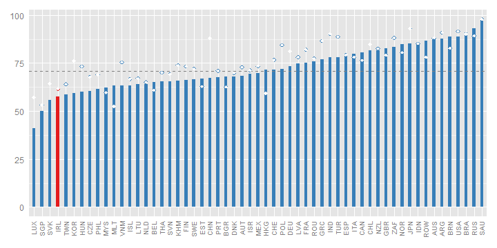
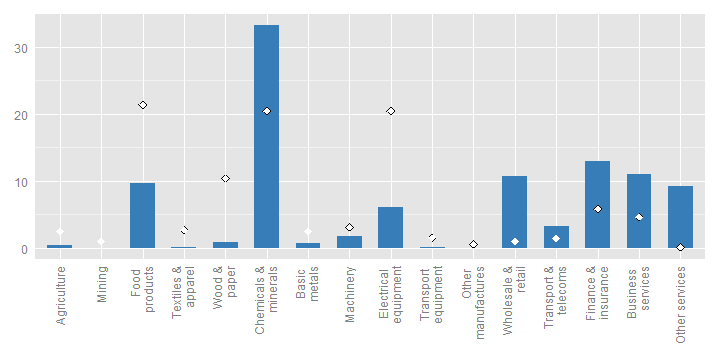
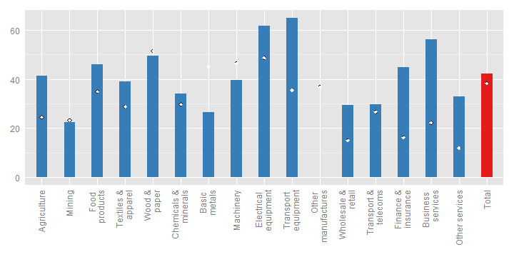
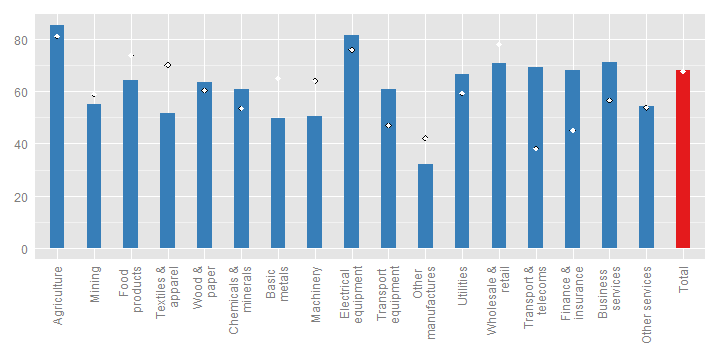
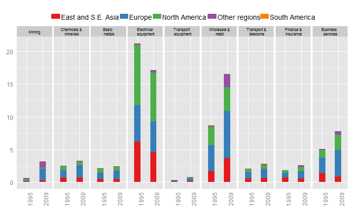
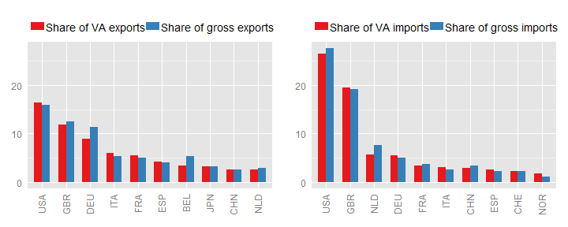
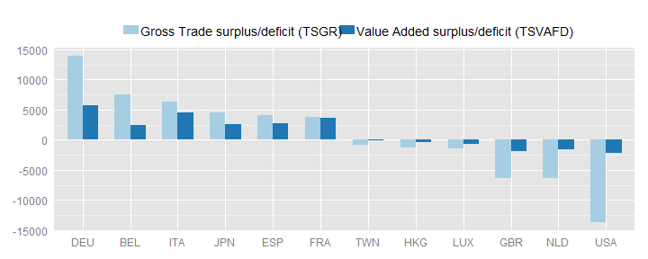
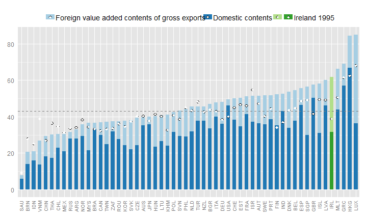
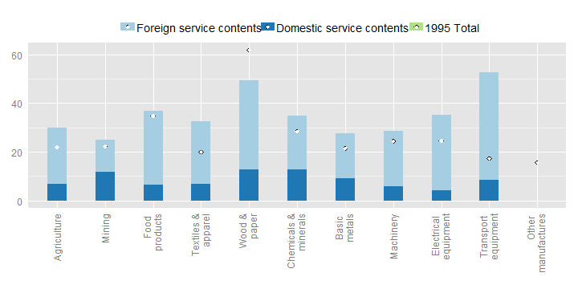

	   
# Trade in Value-added: Ireland

## EXGRDVA\_EX {#exgrdvaex}

### Domestic value added content of gross exports, 2009, %
 

Ireland's domestic value-added content of its exports is, at 58%, below the OECD average in 2009.

Irelands’ domestic value-added content of its exports was 58% in 2009, below the OECD average (76%), and the third lowest in the OECD.  This was 4% below the share in 1995 but 8% higher than the share in 2000, largely reflecting Ireland's increasing specialisation in services exports. Domestic value-Added embodied in Ireland's direct export of services contributed nearly half of Ireland's total value-added exports in 2009 (compared to 13% in 1995), with the domestic value-added embodied in exports of Chemicals and minerals contributing one-third of all value-added exports, up from one-fifth in 1995.  Correspondingly the importance of Food products, Wood products and Electrical equipment products fell significantly.

## EXGRDVA {#exgrdva}

### Domestic Value added in gross exports, industry shares, 2009, %
 


## EXGR\_FVASH {#exgrfvash}

### Foreign value-added content of gross exports, by industry, 2009, %
 

The foreign content of its exports is highest in the transport equipment industry, where about 65% of the value of exports consists of foreign value added.
The electrical equipment, business services and wood and paper industries also have relatively high shares of foreign content (49-62%).

The significant shift in the structural composition of Ireland's exports has resulted in significant changes in the foreign content of exports in many sectors, particularly services.  The foreign content of Wholesale and retail services exports doubled to 29%, and nearly trebled in Business services (56%) and Finance and Insurance services (45%). The foreign content of Chemicals and minerals exports remained largely unchanged at about one-third.


## REI {#rei}

### Share of imported intermediate inputs that are exported, by import category, 2009, %
 
  
The share of intermediate imports that are used in producing exports are highest in the following industries:
agriculture (85%);
electrical equipment (82%);
business services (71%);
wholesale and retail (71%);
transport and telecommunications (69%) and
finance and insurance (68%),
illustrating the integration of many Irish industries in global value chains.
68% of all intermediate imports are used to produce exports.

Over two-thirds (68%) of all intermediate imports in Ireland were used in the production of exports in 2009, unchanged from the share in 1995 but there were significant changes in some products, especially services. Over two thirds of intermediate imports of Wholesale and retail, Transport and telecoms, and Finance and insurance services were used in producing exports, significantly higher than the shares in 1995.  The shares are very high, compared to other OECD economies, across all imported goods, with over 80% of imported intermediates of Agriculture products and Electrical equipment used in the production of exports, and over half in nearly all other import categories.


## EXGR\_VA\_BSCI {#exgrvabsci}
### Origin of foreign value-added in gross exports, electrical equipment (ISIC Rev. 3 30T33), by region and product group, 2009, %
 

In 2009,
17% of
Ireland's exports in value added terms originated in the
electrical equipment sector. The industry is well integrated in global value chains, with significant inputs of intermediate goods and services from Europe (24% of the value added in gross exports)

One-third of the value of Ireland's direct exports by the Chemicals and minerals industry reflected foreign content in 2009, largely unchanged from 1995.  Much of this reflects foreign services content (such as payments for intellectual property), often provided by parents of Irish affiliates. The share of imported Wholesale and retail services fell by over 5% between 1995 and 2009, while the contribution of imported Business services rose by the same amount (Fig. 4). Ireland’s participation in the value chain also appears to have increasingly evolved from regional to global, with a notable rise in the contribution of intermediate services from North America.


## FDDVASH {#fddvash}

### Exports and imports, partner shares, in gross and value-added terms, 2009, % of total
 

Looking at gross flows United States and United Kingdom are Ireland's major trading partners, consuming about 16% and 12% of its exports, respectively.
In value-added terms, United States remains Ireland's biggest partner, consuming about 16% of its exports and United Kingdom remains it's second biggest partner.

The United States and the United Kingdom remain Ireland’s main trade partners in value-added terms, both as export destinations and import sources. The export share of the United States is slightly higher in value-added terms (16%) than in gross terms, but the share of the United Kingdom (12%) is slightly lower.

## TSVAFD {#tsvafd}

### Bilateral trade balances, USD million, 2009
 

Total Irish exports and imports in value-added terms were about 40% smaller than gross measures, although the overall trade balance is identical in value-added and gross terms. These smaller flows are the main drivers for changes in bilateral trade balances, characterised as smaller bilateral surpluses and deficits with partners. The bilateral deficit with the United States, in particular, is 85% smaller in value-added terms (Fig. 6).

## SERV\_VAGR {#servvagr}

### Services content of gross exports, 2009
 
  
In value added terms about 62% of Ireland's exports reflect services.
This is above the (unweighted) OECD average (about 43%).

In value-added terms, 62% of Ireland’s exports in 2009 originated in services sectors (Fig. 7). This is largely above the OECD average (48%) and the 1995 share (38%), reflecting Ireland’s increasing specialisation in services activities. The contribution of services to manufacturing exports is particularly high in Transport equipment (66%) and Wood and paper (49%). Unlike most OECD countries, the foreign services content is larger than the domestic services content in all goods sectors (Fig. 8).

## SERV\_VAGR (ind) {#servvagrind}

### Services content of gross exports, by industry, 2009

```
## Warning: Removed 2 rows containing missing values (position_stack).
```

 


The information included in this note is based on the May 2013 release of the Trade in Value-Added (TiVA) database. The data can be accessed from http://www.oecd.org/trade/valueadded. For further information, please contact tiva.contact@oecd.org.
