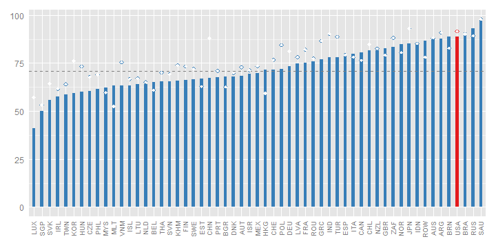
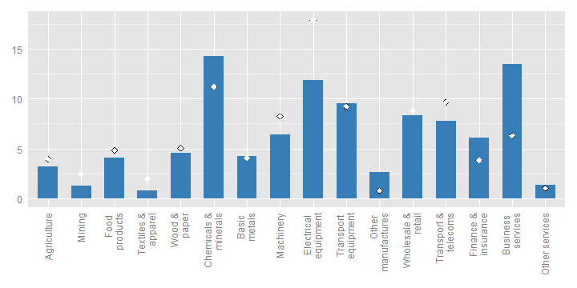
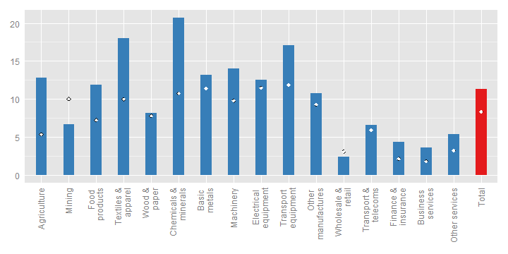
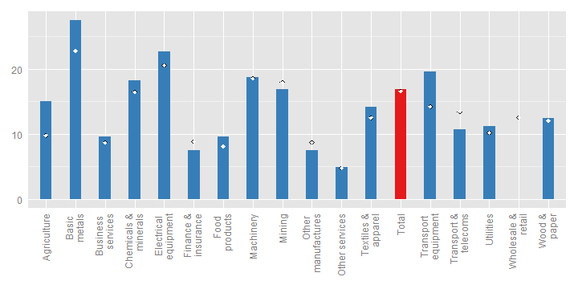
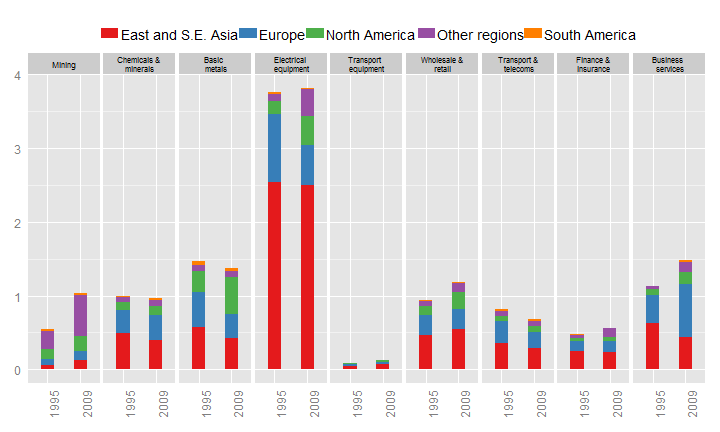
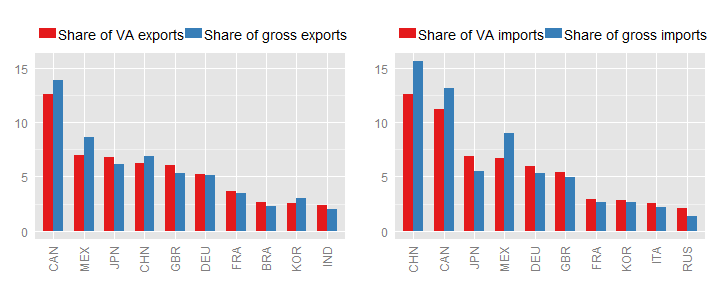
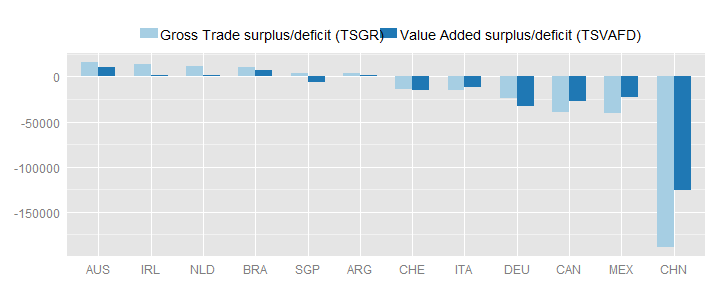
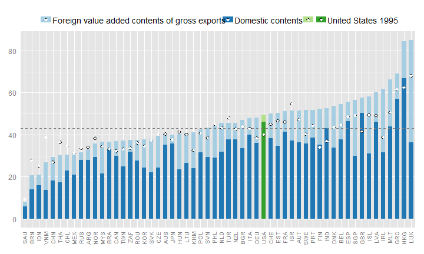
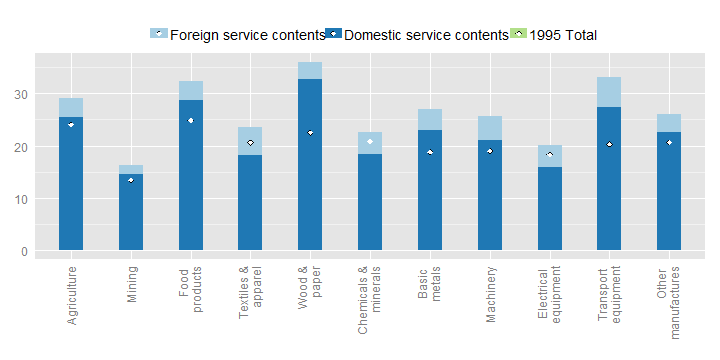

	   
# Trade in Value-added: United States

## EXGRDVA\_EX {#exgrdvaex}

### Domestic value added content of gross exports, 2009, %
 

United States's domestic value-added content of its exports is, at 89%, above the OECD average in 2009.

The United State's domestic value-added content of its exports in 2009 was 89%, the highest in the OECD, reflecting its relatively large size and greater ability to source intermediate inputs from domestic providers. The share was marginally lower than its share in 1995 (92%) but the fall is party masked by the effects of the crisis which had a proportionally greater impact on globally fragmented production chains than on domestic value chains and also an increasing specialisation in business services, which have a higher domestic value-added content than goods. For example, the foreign content of US exports nearly doubled between 1995 and 2008, rising from 8% to 15% and the overall share of value-added embodied in business services exports more than doubled from 6% in 1995 to 13% in 2009.  (Fig. 2).

## EXGRDVA {#exgrdva}

### Domestic Value added in gross exports, industry shares, 2009, %
 

## EXGR\_FVASH {#exgrfvash}

### Foreign value-added content of gross exports, by industry, 2009, %
 

The foreign content of its exports is highest in the chemicals and minerals industry, where about 21% of the value of exports consists of foreign value added.
The textile and apparel, transport equipment and machinery industries also have relatively high shares of foreign content (14-18%).

Although the overall foreign content of the United States exports was relatively unchanged in 2009 compared to 1995, shares rose in most sectors. The foreign content of chemicals and minerals exports for example nearly doubled from 11% in 1995 to 21% in 2009. 

## REI {#rei}

### Share of imported intermediate inputs that are exported, by import category, 2009, %
 
  
The share of intermediate imports that are used in producing exports are highest in the following industries:
basic metals (27%);
electrical equipment (23%);
transport equipment (20%);
machinery (19%);
chemicals and minerals (18%) and
mining (17%),
illustrating the integration of many US industries in global value chains.
17% of all intermediate imports are used to produce exports.

The share of intermediate imports used to produce exports was highest in basic metals (27%). About one-fifth of total intermediate imports in the following products was used in producing exports: chemicals and minerals, electrical equipment, transport equipment, and machinery. Shares were little changed between 1995 and 2009.

## EXGR\_VA\_BSCI {#exgrvabsci}
### Origin of foreign value-added in gross exports, electrical equipment (ISIC Rev. 3 30T33), by region and product group, 2009, %
 

In 2009,
4% of
United States's exports in value added terms originated in the
electrical equipment sector. The industry is well integrated in global value chains, with significant inputs of intermediate goods and services from East and South East Asia (5% of the value added in gross exports)

The foreign content of US transport equipment increased from 12% in 1995 to 17% in 2009, with the increase spread across all regions. Asia's share increased 2.5% over the period to 7%,  while the shares from Europe and North America increased by 1% to 5.5.% and 2.5% respectively. Interestingly the foreign content of electronic components and business services increased significantly while the content provided by upstream transport equipment manufacturers was only marginally higher, explained by the increasing knowledge and hi-tech intensity of transport equipment.

## FDDVASH {#fddvash}

### Exports and imports, partner shares, in gross and value-added terms, 2009, % of total
 

Looking at gross flows Canada and Mexico are United States's major trading partners, consuming about 14% and 9% of its exports, respectively.
In value-added terms, Canada remains United States's biggest partner, consuming about 13% of its exports and Mexico remains it's second biggest partner.

In terms of exports the United States trading partners remain broadly similar in gross and value-added terms. It's share of exports to its NAFTA trading partners is slightly lower however reflecting the embodiment of US value-added in NAFTA partner exports. For similar reasons US exports to Ireland are also smaller in value added terms. Its major partner countries for imports are also broadly unchanged but the contribution from China is significantly lower, reflecting the relatively Chinese content in Chinese exports, as are the contributions from NAFTA partners, reflecting the embodiment of their exports in US exports to third countries. Japan and Germany's shares are higher in value-added terms reflecting the embodiment of their exports in third country (e.g. China) exports to the United States.

## TSVAFD {#tsvafd}

### Bilateral trade balances, USD million, 2009
 

These various flows, domestic value-added embodied in exports and intermediate imports embodied in exports, combine to reveal a notable shift in the United State's bilateral trade balances States (as recorded in the OECD-WTO TiVA database). The US trade deficit with China for example was one-third smaller in value-terms. Deficits were also smaller with NAFTA partners but increased with Japan, Korea and Germany.

## SERV\_VAGR {#servvagr}

### Services content of gross exports, 2009
 
  
In value added terms about 50% of United States's exports reflect services.
This is above the (unweighted) OECD average (about 43%).

Considering the origin of value-added exports, in value added terms just under  half of the United States  exports reflect services, marginally higher than the OECD average (48%) and nearly 10% higher than the share in 1995. The contribution of services rose in all industries, particularly the basic metals industry, where the services content typically ranged from around one-quarter to one-third of the total value.

## SERV\_VAGR (ind) {#servvagrind}

### Services content of gross exports, by industry, 2009
 

The information included in this note is based on the May 2013 release of the Trade in Value-Added (TiVA) database. The data can be accessed from http://www.oecd.org/trade/valueadded. For further information, please contact tiva.contact@oecd.org.
