<iframe src="http://10.101.26.220:3838/co2app/" width = "100%" style="border: 0px; height: 52em"></iframe>

The difference between the IEA data (CO2 emissions from fuel combustion, sectoral approach) and the OECD data (Prduction-based CO2 emission estimates) are due to the reallocation of CO2 emissions associated with fuel purchases by non-residents. More information is available at [oe.cd/io-co2](http://oe.cd/io-co2).

<!-- ## Axis Label (LHS): "Mt CO2" -->

<!-- ## Axis Label (RHS): "% deviation" -->

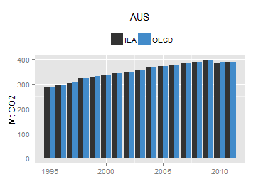 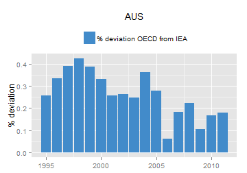 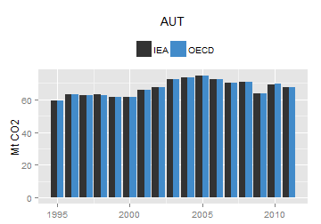 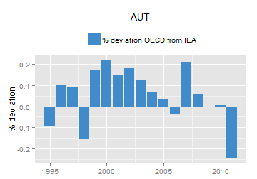 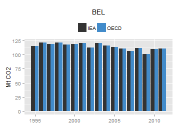 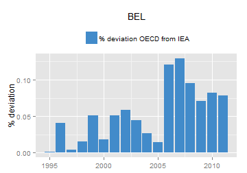 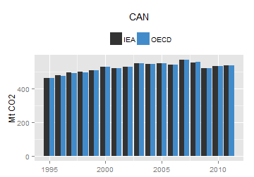 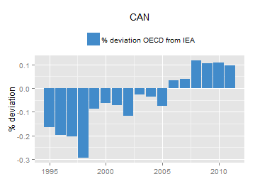 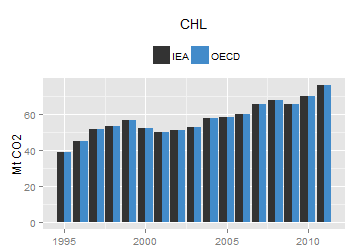 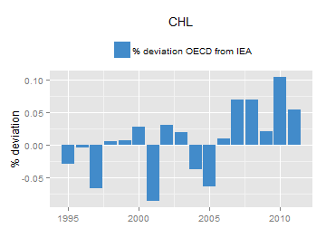 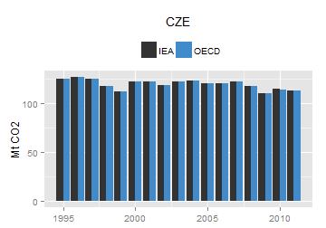 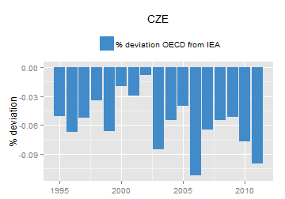 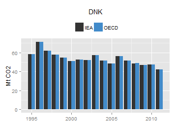 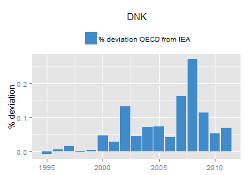 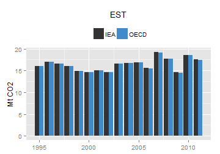 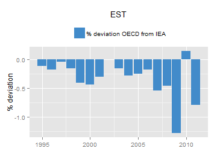 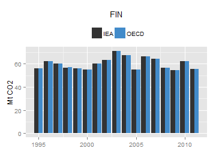 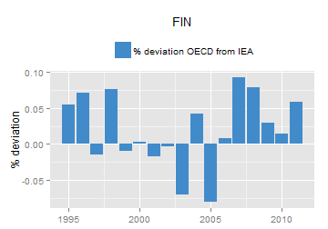 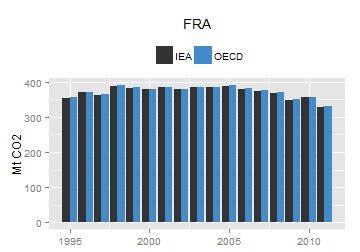 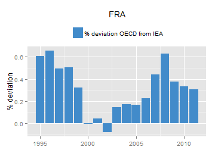 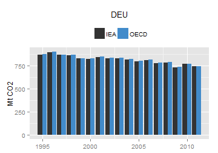 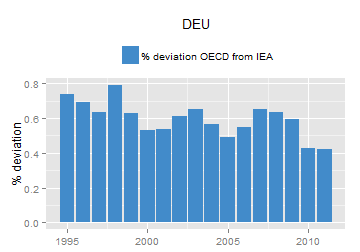 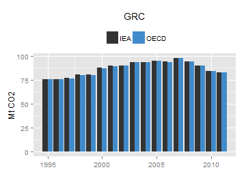 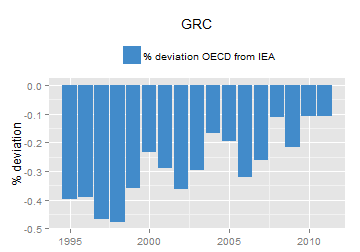 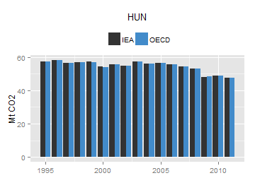 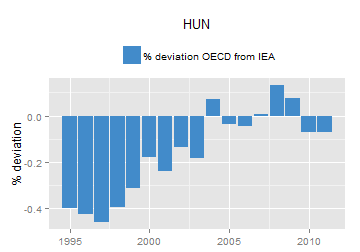 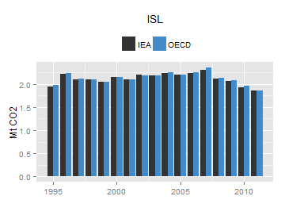 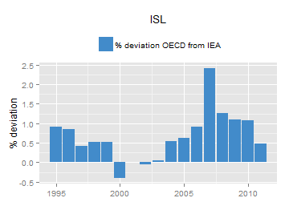 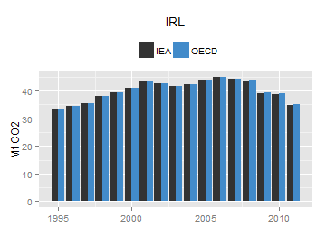 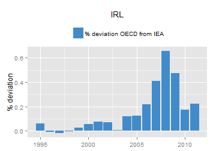 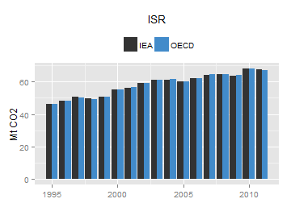 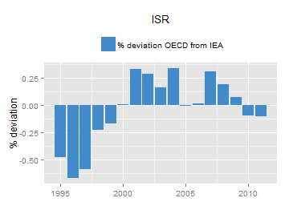 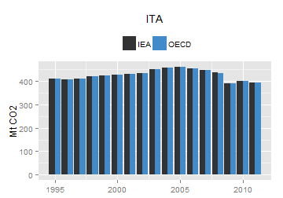 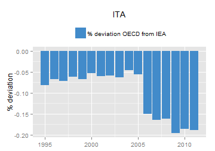 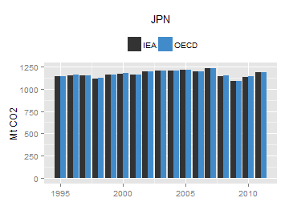 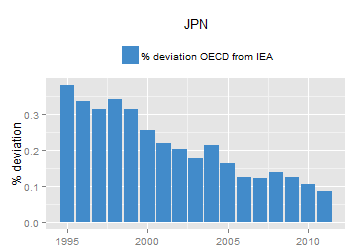 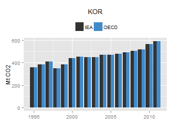 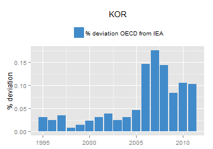 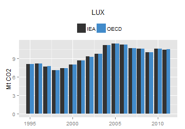 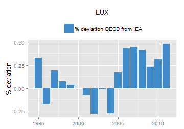 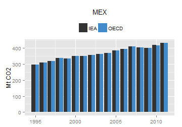 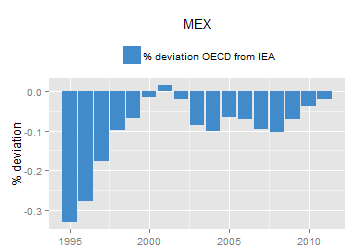 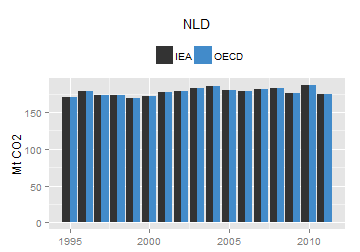 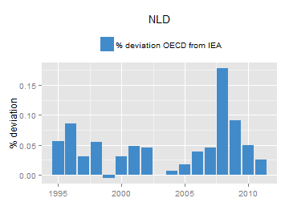 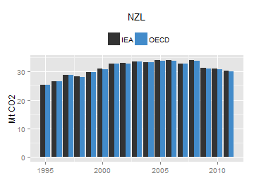 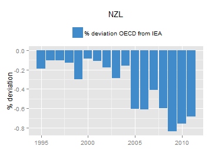 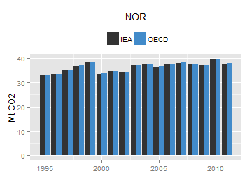 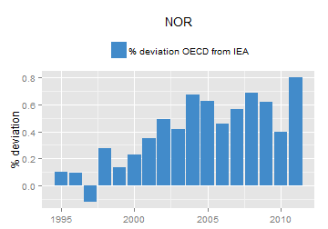 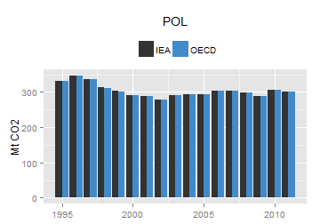 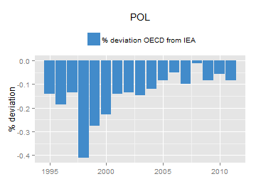                                                                           

