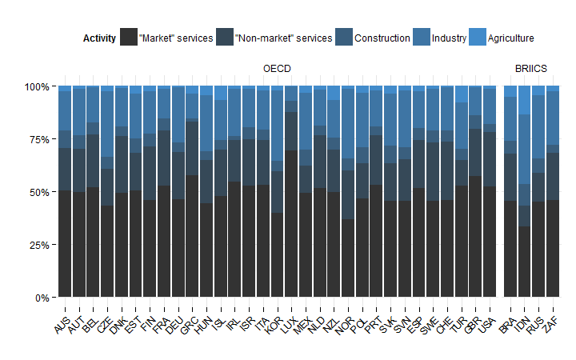
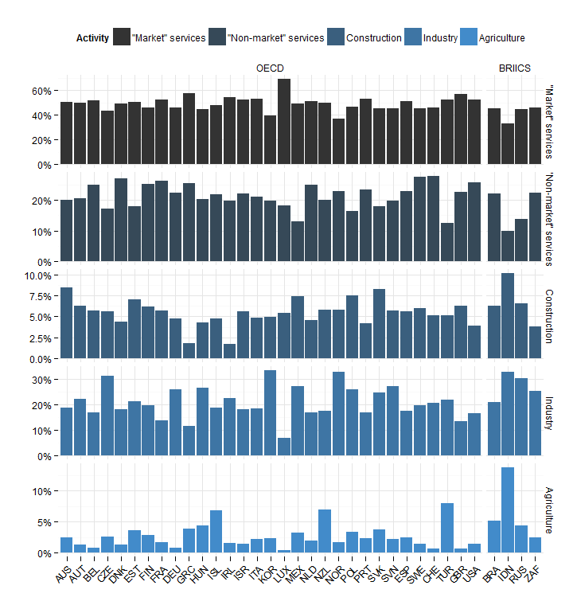
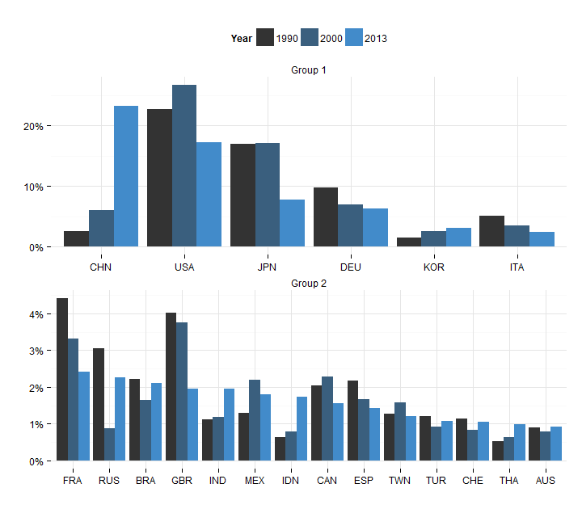

---

title: STAN Score 15
layout: default
output: bookdown::html_chapter
---

# Scoreboard 2015 - STAN Section

## Composition of GDP in OECD and BRIICS countries {#gdp_composition}

|                   | "Market" services| "Non-market" services| Construction| Industry| Agriculture|
|:------------------|-----------------:|---------------------:|------------:|--------:|-----------:|
|Australia          |              50.3|                 20.10|         8.44|    18.62|        2.51|
|Austria            |              49.7|                 20.56|         6.31|    22.06|        1.34|
|Belgium            |              51.8|                 24.98|         5.72|    16.79|        0.74|
|Czech Republic     |              43.4|                 17.27|         5.58|    31.12|        2.61|
|Denmark            |              49.2|                 27.05|         4.40|    18.12|        1.27|
|Estonia            |              50.3|                 17.83|         7.05|    21.12|        3.67|
|Finland            |              45.9|                 25.32|         6.18|    19.78|        2.81|
|France             |              52.6|                 26.23|         5.67|    13.76|        1.68|
|Germany            |              46.2|                 22.40|         4.76|    25.93|        0.75|
|Greece             |              57.5|                 25.36|         1.79|    11.56|        3.81|
|Hungary            |              44.5|                 20.36|         4.31|    26.41|        4.43|
|Iceland            |              47.8|                 21.90|         4.74|    18.70|        6.84|
|Ireland            |              54.7|                 19.68|         1.74|    22.36|        1.56|
|Israel             |              52.6|                 22.13|         5.56|    18.26|        1.40|
|Italy              |              53.3|                 21.17|         4.86|    18.52|        2.17|
|Republic of Korea  |              39.7|                 19.72|         4.94|    33.29|        2.34|
|Luxembourg         |              69.3|                 18.21|         5.40|     6.79|        0.34|
|Mexico             |              49.1|                 13.12|         7.40|    27.07|        3.28|
|Netherlands        |              51.5|                 25.04|         4.55|    16.89|        1.99|
|New Zealand        |              49.7|                 20.03|         5.76|    17.62|        6.92|
|Norway             |              37.0|                 22.97|         5.79|    32.61|        1.68|
|Poland             |              46.8|                 16.50|         7.52|    25.86|        3.32|
|Portugal           |              53.1|                 23.47|         4.19|    16.99|        2.29|
|Slovakia           |              45.4|                 17.83|         8.29|    24.69|        3.74|
|Slovenia           |              45.3|                 19.70|         5.73|    27.07|        2.15|
|Spain              |              51.5|                 22.95|         5.56|    17.52|        2.49|
|Sweden             |              45.5|                 27.49|         5.94|    19.67|        1.40|
|Switzerland        |              45.8|                 27.77|         5.11|    20.63|        0.71|
|Turkey             |              52.5|                 12.36|         5.12|    21.95|        8.03|
|United Kingdom     |              57.1|                 22.56|         6.27|    13.49|        0.61|
|United States      |              52.3|                 25.75|         3.91|    16.59|        1.45|
|Brazil             |              45.6|                 22.13|         6.27|    20.90|        5.12|
|Indonesia          |              33.4|                  9.96|        10.14|    32.81|       13.72|
|Russian Federation |              45.0|                 13.91|         6.53|    30.22|        4.36|
|South Africa       |              46.0|                 22.37|         3.83|    25.37|        2.46|

- Data are 2014 from OECD STD SNA Table 1 unless specified otherwise
- Data for 2013: Australia, Czech Republic, Iceland, Ireland, Israel, Luxembourg, Mexico, Switzerland, United States
- Data for South Africa and Russian Federation: 2011, from UNSD Main Aggregates
and Detailed Tables

## Top Manufacturers in the last 20 years {#top_manufacturers}

|                   |  1990|  2000|  2013|
|:------------------|-----:|-----:|-----:|
|China              |  2.65|  6.45| 23.20|
|United States      | 23.25| 28.47| 17.17|
|Japan              | 17.40| 18.27|  7.76|
|Germany            | 10.01|  7.33|  6.31|
|Republic of Korea  |  1.58|  2.67|  3.14|
|Italy              |  5.24|  3.66|  2.43|
|France             |  4.53|  3.54|  2.42|
|Russian Federation |  3.13|  0.94|  2.27|
|Brazil             |  2.27|  1.76|  2.10|
|United Kingdom     |  4.13|  3.99|  1.96|
|India              |  1.15|  1.26|  1.95|
|Mexico             |  1.33|  2.33|  1.80|
|Indonesia          |  0.65|  0.84|  1.74|
|Canada             |  2.09|  2.42|  1.56|
|Spain              |  2.22|  1.76|  1.42|
|Chinese Taipei     |  1.31|  1.69|  1.21|
|Turkey             |  1.23|  0.98|  1.07|
|Switzerland        |  1.16|  0.88|  1.05|
|Thailand           |  0.54|  0.66|  0.99|
|Australia          |  0.92|  0.83|  0.91|
